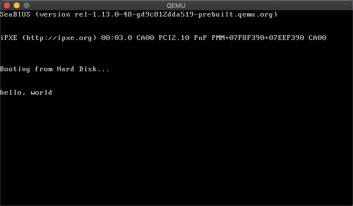

# 第一天

## 说明：基于Mac环境

1. 下载软件

    + `HexFiend` 直接在`Mac`商店下载
    + 下载 `QEMU` 虚拟机

        Homebrew:

        ```shell
        brew install qemu
        ```

        MacPorts:

        ```shell
        sudo port install qemu
        ```

2. 编写`Hello World`
    + 打开`HexFiend`
    + 以下没有提及的地方数据全部填0
    + 000000-000080 添加如下数据

        ```
        EB4E9048 454C4C4F 49504C00 02010100 02E00040 0BF00900 12000200 00000000 400B0000 000029FF FFFFFF48 454C4C4F 2D4F5320 20204641 54313220 20200000 00000000 00000000 00000000 00000000 B800008E D0BC007C 8ED88EC0 BE747C8A 0483C601 3C007409 B40EBB0F 00CD10EB EEF4EBFD 0A0A6865 6C6C6F2C 20776F72 6C640A00 00000000 00000000 00000000
        ```

        

    + 0001F0-000200 添加如下数据

        ```
        00000000 00000000 00000000 000055AA F0FFFFFF FFFFFFFF FF000000 00000000
        ```

        

    + 001400 添加如下数据

        ```
        F0FFFFFF FFFFFFFF FF000000 00000000
        ```

        

    + 到 167FF0 为止

        

    + 保存上面的文件 `helloos.img`
    + 如果愿意编写可以通过[此链接](https://github.com/ncdhz/os-study/blob/main/day01/helloos.img)下载

        

3. 运行第一个操作系统

    + 执行命令 `qemu-system-i386 -hdd helloos.img` 如果没有找到 `qemu-system-i386` 命令就是刚才下载 `qemu` 没有配置环境变量（通过`brew info qemu`找到路径然后自行配置环境变量）

        

        

## 原理解释

到这里为止已经开发好了一个可以用虚拟机（真实的机器也可以）跑的程序了，不过还并不知道上面书写的是什么意思和对于我们来说意味着什么。可以先做以下的理解：上面的程序就是用16进制写了一个软盘格式文件（就像任何语言都有自己特定的格式），并且能够输出 `hello world`。这意味着我们已经可以做到电脑启动时就能自动加载我们书写的代码，听上去没有什么高级的，但是这好像就是做操作系统最开始的一步吧。注意：整个文件的大小必须是 `1474560` 字节，刚好为一个3.5寸软盘大小。

## 通过汇编的方式完成上面的程序

1. 下载 `nasm` 汇编编译器

    ```shell
    brew install nasm
    ```

2. 编写如下汇编程序

    ```nasm
    ; hello-os
    ; TAB=4
    
    ; 标展FAT12格式软盘专用的代码 Stand FAT12 format floppy code
        DB      0xeb, 0x4e, 0x90      ;
        DB      "HELLOIPL"            ; 启动扇区名称（8字节）
        DW      512                   ; 每个扇区（sector）大小（必须512字节）
        DB      1                     ; 簇（cluster）大小（必须为1个扇区）
        DW      1                     ; FAT起始位置（一般为第一个扇区）
        DB      2                     ; FAT个数（必须为2）
        DW      224                   ; 根目录大小（一般为224项）
        DW      2880                  ; 该磁盘大小（必须为2880扇区1440*1024/512）
        DB      0xf0                  ; 磁盘类型（必须为0xf0）
        DW      9                     ; FAT的长度（必须是9扇区）
        DW      18                    ; 一个磁道（track）有几个扇区（必须为18）
        DW      2                     ; 磁头数（必须是2）
        DD      0                     ; 不使用分区，必须是0
        DD      2880                  ; 重写一次磁盘大小
        DB      0,0,0x29              ; 意义不明（固定）
        DD      0xffffffff            ; （可能是）卷标号码
        DB      "HELLO-OS   "         ; 磁盘的名称（必须为11字节，不足填空格
        DB      "FAT12   "            ; 磁盘格式名称（必须是8字节，不足填空格）
        RESB    18                    ; 先空出18字节
    
    ; 程序主体
        DB  0xb8, 0x00, 0x00, 0x8e, 0xd0, 0xbc, 0x00, 0x7c
        DB  0x8e, 0xd8, 0x8e, 0xc0, 0xbe, 0x74, 0x7c, 0x8a
        DB  0x04, 0x83, 0xc6, 0x01, 0x3c, 0x00, 0x74, 0x09
        DB  0xb4, 0x0e, 0xbb, 0x0f, 0x00, 0xcd, 0x10, 0xeb
        DB  0xee, 0xf4, 0xeb, 0xfd
    ; 信息显示部分
        DB  0x0a, 0x0a  ; 换行两次
        DB  "hello, world"
        DB  0x0a   ; 换行
        DB  0
        RESB 0x1fe-($-$$) ; 填写0x00直到0x001fe
        DB  0x55, 0xaa
    ; 启动扇区以外部分输出
        DB  0xf0, 0xff, 0xff, 0x00, 0x00, 0x00, 0x00, 0x00
        RESB 4600
        DB  0xf0, 0xff, 0xff, 0x00, 0x00, 0x00, 0x00, 0x00
        RESB 1469432
    ```

3. 执行下面语句构建 `img` 软盘

    ```shell
    nasm -f bin helloos.asm -o helloos.img
    # 其中 helloos.asm 是刚才新建的文件 helloos.img 是生成的文件
    ```

4. 和上面一样用虚拟机运行软盘

    ```shell
    qemu-system-i386 -hdd helloos.img
    ```

    
