# Flex 布局讲解

1. 初始化 `Demo`

    ```html
    <!DOCTYPE html>
    <html lang="en">
    <head>
        <meta charset="UTF-8">
        <meta name="viewport" content="width=device-width, initial-scale=1.0">
        <title>flex</title>
        <style>
            .main {
                border: 1px solid green;
            }
            .main div {
                height: 100px;
                width: 120px;
                border: 1px solid beige;
            }
            .div1 {background-color: red;}
            .div2 {background-color: rgb(47, 165, 201);}
            .div3 {background-color: blue;}
        </style>
    </head>
    <body>
        <div class="main">
            <div class="div1">div1</div>
            <div class="div2">div2</div>
            <div class="div3">div3</div>
        </div>
    </body>
    </html>
    ```

    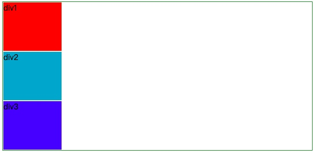

2. 排列效果

   + 添加代码到 `.main` 选择器中

        ```css
        .main {
            display: flex;
            /*主轴是横轴还是纵轴*/
            /* 下面是默认属性 */
            /* flex-direction: row; */
            /* 元素排列方式*/
            /* 下面是默认属性  */
            /* justify-content: flex-start; */
        }
        ```

    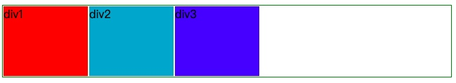

   + 现在我们可以看到`div`都横向排列了
   + 我们可以通过改变 `flex-direction` 和 `justify-content` 属性来查看一下效果

        ```css
        .main {
            display: flex;
            justify-content: flex-end;
        }
        ```

    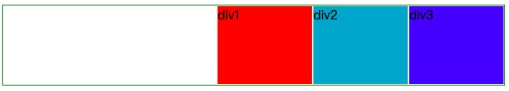

        ```css
        .main {
            display: flex;
            /* 这个属性如下图所示，中间间距是两边间距的两倍 */
            justify-content: space-around;
        }
        ```

    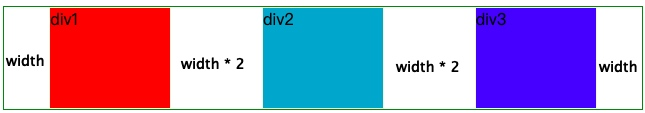

        ```css
        .main {
            display: flex;
            justify-content: space-between;
        }
        ```

    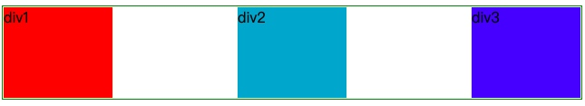

3. 多子元素处理
    + 换行
        + 我们多加几个`div`

            ```html
            <div class="main">
                <div class="div1">div1</div>
                <div class="div2">div2</div>
                <div class="div3">div3</div>
                <div class="div1">div1</div>
                <div class="div2">div2</div>
                <div class="div3">div3</div>
                <div class="div1">div1</div>
                <div class="div2">div2</div>
                <div class="div3">div3</div>
                <div class="div1">div1</div>
                <div class="div2">div2</div>
                <div class="div3">div3</div>
            </div>
            /* 通过下图我们发现刚才设置div的宽度失效了，他没有换行*/
            ```

        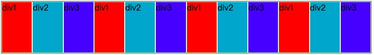

        + 换行处理

            ```css
            .main {
                display: flex;
                flex-wrap: wrap;
            }
            ```

        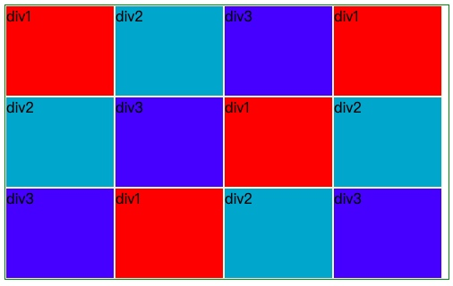

    + 子元素基于父元素样式（间距是均分或者中间是两边的两倍）
       + 设置父元素高度

            ```css
            .main {
                display: flex;
                height: 600px;
                flex-wrap: wrap;
            }
            ```

        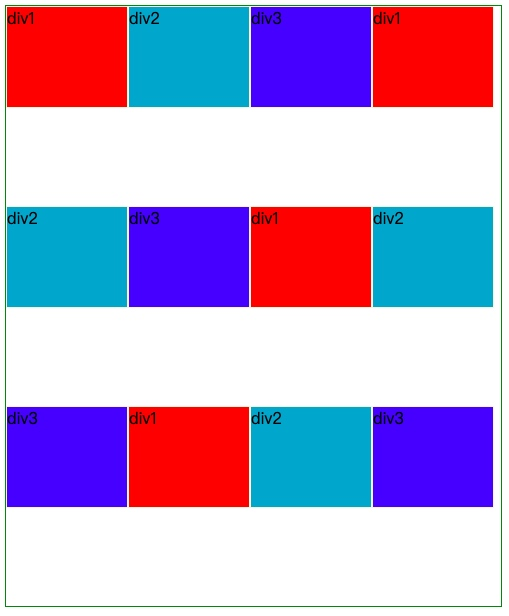

        + 子元素是纵向居中对齐

            ```css
            .main {
                display: flex;
                flex-wrap: wrap;
                align-items: center;
            }
            ```

        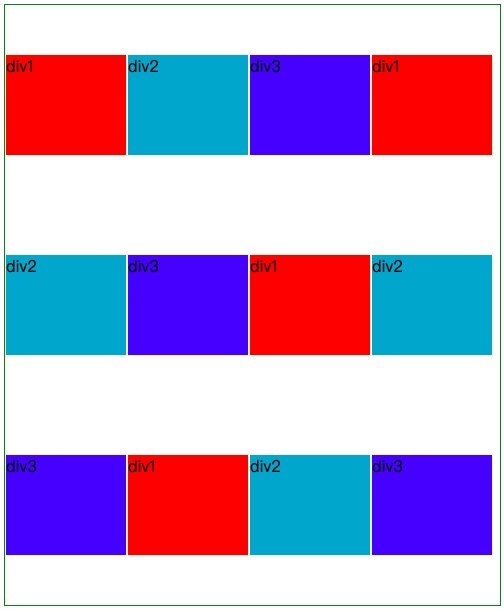

        + 子元素是纵向向下对齐

            ```css
            .main {
                display: flex;
                flex-wrap: wrap;
                align-items: flex-end;
            }
            ```

        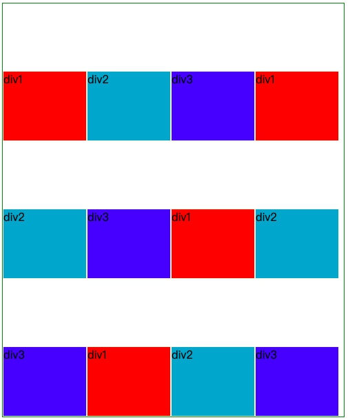
    + 子元素基于父元素样式（间距居中）
        + 子元素是纵向向上对齐

            ```css
            .main {
                display: flex;
                flex-wrap: wrap;
                align-content: flex-start;
            }
            ```

        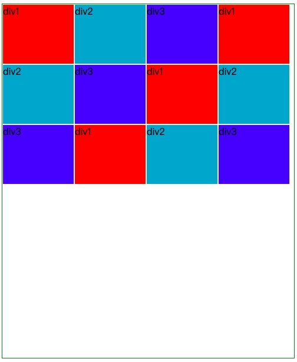
        + 子元素是纵向居中对齐

            ```css
            .main {
                display: flex;
                flex-wrap: wrap;
                align-content: center;
            }
            ```

        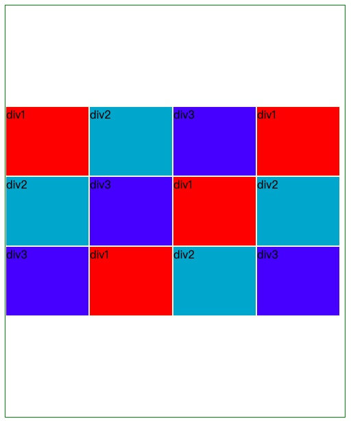

        + 子元素是纵向向下对齐

            ```css
            .main {
                display: flex;
                flex-wrap: wrap;
                align-content: flex-end;
            }
            ```

        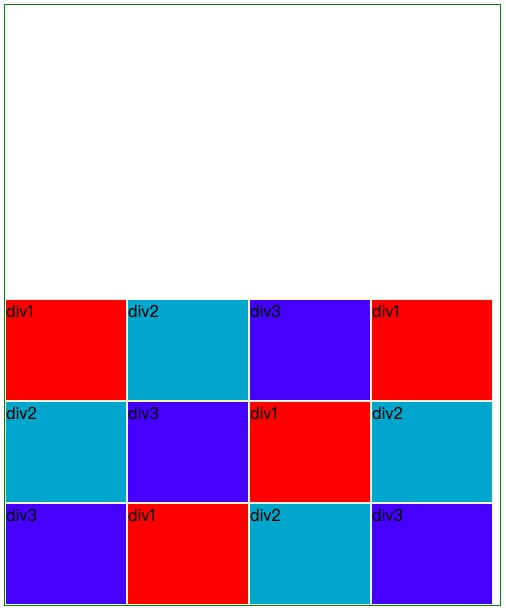
        + 子元素是纵向置顶对齐

            ```css
            .main {
                display: flex;
                flex-wrap: wrap;
                align-content: space-between;
            }
            ```

        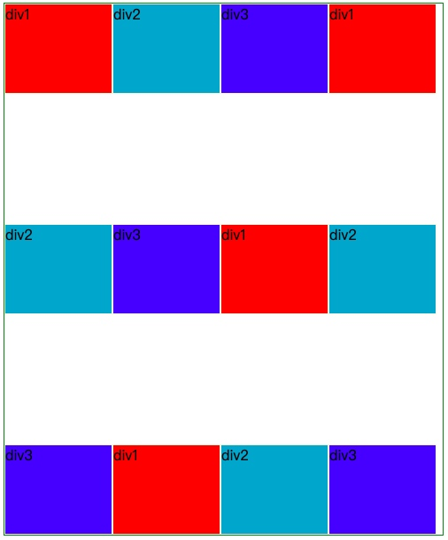

4. 注意
    + 设置 `Flex` 布局之后，子元素 `float`、`clear` 和 `vertical-align` 属性将失效
