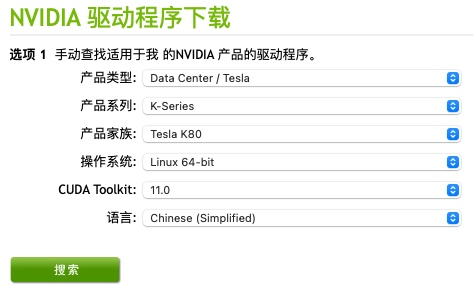
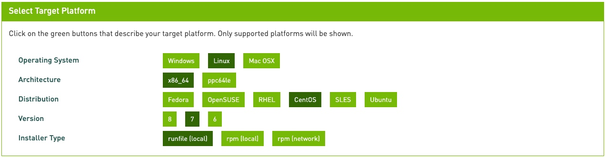

# Centos7 安装 CUDA

## 卸载CUDA

```shell
# 如果以前安装过 cuda 需要执行下面操作
# cd 到指定版本cuda的bin目录下
cd /usr/local/cuda-*/bin
# 执行卸载操作
sudo ./uninstall_cuda_toolkit_*.pl
# 或者是
sudo /usr/local/cuda*/bin/cuda-uninstaller
```

## 禁用nouveau

1. 查看 nouveau 是否被禁用

    ```shell
    # 有输出信息说明没有被禁用
    lsmod | grep nouveau
    ```

2. 禁用方法

    ```shell
    # 一下操作可能需要管理员权限 sudo
    vi /usr/lib/modprobe.d/dist-blacklist.conf
    # 在打开的文件中添加
    blacklist nouveau

    options nouveau modeset=0
    # 当前镜像备份
    mv /boot/initramfs-$(uname -r).img /boot/initramfs-$(uname -r).img.bak
    # 建立新的镜像
    dracut /boot/initramfs-$(uname -r).img $(uname -r)
    # 重启电脑
    shutdown -r now
    # 查看 nouveau 是否被禁用
    lsmod | grep nouveau
    ```

## 配置安装环境

1. 安装 `gcc`

    ```shell
    # 查看是否安装过 gcc
    gcc -v
    # 没有安装执行下面命令
    yum install gcc
    ```

2. 安装内核Headers和开发包

    ```shell
    # 验证系统是否安装了正确的内核Headers和开发包
    uname -r
    # 没有的话可以安装
    sudo yum install kernel-devel-$(uname -r) kernel-headers-$(uname -r)
    # 检查安装版本，这里可能遇到的情况有kernel存在两个版本，这时候要卸载一个，确保存在的kernel与kernel-devel和kernel-header包的版本号一致
    # 检查
    rpm -qa|grep gcc
    rpm -qa|grep kernel
    # 卸载
    rpm -e --nodeps 刚才查出来的name
    ```

## 下载并安装驱动

1. 到官网下载合适的显卡驱动 [https://www.nvidia.cn/Download/index.aspx?lang=cn](https://www.nvidia.cn/Download/index.aspx?lang=cn)

    ```shell
    # 通过下面命令可以查看显卡信息
    lspci | grep -i nvidia
    ```

    

    ```shell
    # 通过下面命令可以下载 后面的链接换成自己需要的链接
    wget https://cn.download.nvidia.com/tesla/450.80.02/NVIDIA-Linux-x86_64-450.80.02.run
    # 如果是远程 centos 可以本地下载然后通过 sftp 上传
    ```

2. 执行下面命令安装

    ```shell
    init 3
    chmod +x 刚才下载的文件
    sudo ./刚才下载的文件
    # 通过下面命令查看是否安装成功
    nvidia-smi
    ```

3. 可能遇到的错误

    + You appear to be running an X server; please exit X before installing

        ```shell
        # 进入管理员用户（不是使用管理员权限）--这步很重要 su root
        # 打开 NVIDIA 安装日志文件
        vi /var/log/nvidia-installer.log
        # 里面会有一个 pid
        # 复制 pid 然后执行
        sudo kill -9 刚才复制的pid
        # 执行下面语句继续安装
        sudo ./nvidia.run
        ```

### 下载并安装 CUDA Toolkit

1. 下载地址 [https://developer.nvidia.com/Cuda-Toolkit-archive](https://developer.nvidia.com/Cuda-Toolkit-archive)

2. 填写信息

    

3. 根据给定的操作步骤操作

    ```shell
    # 下面使用的是本地安装
    # 下载文件
    wget https://developer.download.nvidia.com/compute/cuda/10.2/Prod/local_installers/cuda_10.2.89_440.33.01_linux.run
    # 运行文件
    sudo sh cuda_10.2.89_440.33.01_linux.run
    ```

4. 注意

    + 安装时取消驱动安装
    + 配置环境变量

        ```shell
        # 地址改为自己的
        export PATH=$PATH:/usr/local/cuda/bin
        export LD_LIBRARY_PATH=/usr/local/cuda/lib64
        ```

## 安装 cuDNN

1. 下载 [https://developer.nvidia.com/rdp/form/cudnn-download-survey](https://developer.nvidia.com/rdp/form/cudnn-download-survey) 需要有nvidia用户才能下载（下载和cuda对应的版本）
2. 解压刚才下载的文件

    ```shell
    tar -xzvf 文件名
    ```

3. cp 下面的文件到 /usr/local/cuda-*中

    ```shell
    cp cuda/include/* /usr/local/cuda-*/include
    cp cuda/lib64/* /usr/local/cuda-9.0/lib64
    ```
