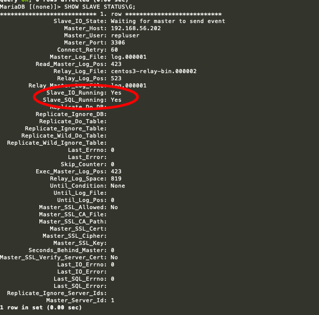

# Centos中mariaDB主从配置  

1. 本机环境  

    ```shell
    #centos7
    ip: 192.168.56.202 主节点
    ip: 192.168.56.203 从节点
    ```

2. 安装 `MariaDB`
    + 检查 `MariaDB` 或 `mysql` 以前是否安装如果安装则卸载
        + 检查 `MariaDB` `rpm -qa | grep MariaDB`
        + 卸载 `MariaDB` `rpm -e --nodeps MariaDB-*`
        + 检查 `mysql` `rpm -qa | grep mysql`
        + 卸载 `mysql` `yum remove mysql mysql-server mysql-libs compat-mysql51`
    + 安装 `MariaDB` `yum -y install mariadb mariadb-server`
    + 启动 `MariaDB` `systemctl start mariadb`
    + 设置开机启动 `MariaDB` `systemctl enable mariadb`
    + 配置 `MariaDB` `mysql_secure_installation`  

        ```
        首先是设置密码，会提示先输入密码
        Enter current password for root (enter for none):<–初次运行直接回车
        设置密码
        Set root password? [Y/n] <– 是否设置root用户密码，输入y并回车或直接回车
        New password: <– 设置root用户的密码
        Re-enter new password: <– 再输入一次你设置的密码
        其他配置
        Remove anonymous users? [Y/n] <– 是否删除匿名用户，回车
        Disallow root login remotely? [Y/n] <–是否禁止root远程登录,回车,
        Remove test database and access to it? [Y/n] <– 是否删除test数据库，回车
        Reload privilege tables now? [Y/n] <– 是否重新加载权限表，回车
        (以上操作也可以根据自己需要配置)
        ```

    + 登入 `MariaDB` `mysql -uroot -p密码`
    + 两台机器做相同配置

3. 关闭两台机器防火墙  

    ```shell
    关闭防火墙
    systemctl stop firewalld.service
    禁止开机启动
    systemctl disable firewalld.service 
    ```

4. 配置主从
    + 对`主节点`配置
        + 修改配置文件  
        进入配置文件

            ```shell
            vi /etc/my.cnf
            ```

        修改配置文件在 `[mysqld]` 中添加

            ```shell
            server_id=1                   #设置当前服务器的ID号
            log_bin=/var/lib/mysql/log    #启动二进制日志并指定文件名
            skip_name_resolve=on          #跳过主机名解析。在CentOS 6自带的mysql后面的=on不用写
            innodb_file_per_table=on      #innodb的每个表是用单独的文件
            ```

        + 重启 `MariaDB` `systemctl restart mariadb`
        + 进入 `MariaDB` `mysql -uroot -p密码`
        + 配置一个用户用于操作主从复制  

            ```shell
            格式: GRANT REPLICATION SLAVE,REPLICATION CLIENT ON *.* TO '账号'@'从节点ip' IDENTIFIED BY '密码';

            如: GRANT REPLICATION SLAVE,REPLICATION CLIENT ON *.* TO 'repluser'@'192.168.56.%' IDENTIFIED BY 'repluser';
            ```

        + 展示一下`master`信息下面要用  

            ```
            SHOW MASTER STATUS;

            +------------+----------+--------------+------------------+
            | File       | Position | Binlog_Do_DB | Binlog_Ignore_DB |
            +------------+----------+--------------+------------------+
            | log.000001 |      423 |              |                  |
            +------------+----------+--------------+------------------+
            ```

    + 对`从节点`配置
        + 和 `主机` 第一步相同修改 `server_id=2` (只要和上面不同就可以)
        + 重启 `MariaDB` `systemctl restart mariadb`
        + 进入 `MariaDB` `mysql -uroot -p密码`
        + 可选设置  

            ```shell
            FLUSH TABLES WITH READ LOCK;     #添加全局读锁
            ```

        + 启动服务  

            ```shell
            CHANGE MASTER TO MASTER_HOST='192.168.56.202',MASTER_USER='主机账号',MASTER_PASSWORD='主机密码',MASTER_LOG_FILE='主机查询的 File 值',MASTER_LOG_POS=主机查询的 Position 值;

            如:  CHANGE MASTER TO MASTER_HOST='192.168.56.202',MASTER_USER='repluser',MASTER_PASSWORD='repluser',MASTER_LOG_FILE='log.000001',MASTER_LOG_POS=423;
            ```

        + 启动`SLAVE`线程 `START SLAVE;`
        + 查看从服务器的状态 `SHOW SLAVE STATUS\G`  
        

        + 从服务器配置失败  

            ```shell
            # 错误信息：Could not find target log during relay log initialization
            # 可以重新配置：（在MariaDB命令行执行） reset slave
            ```

5. 授权远程连接 （初始化也可以开启）  

    ```shell
    GRANT ALL PRIVILEGES ON *.* TO 'root'@'%'IDENTIFIED BY '密码' WITH GRANT OPTION;
    ```

6. 现在可以在`主节点`中新建数据库尝试了
