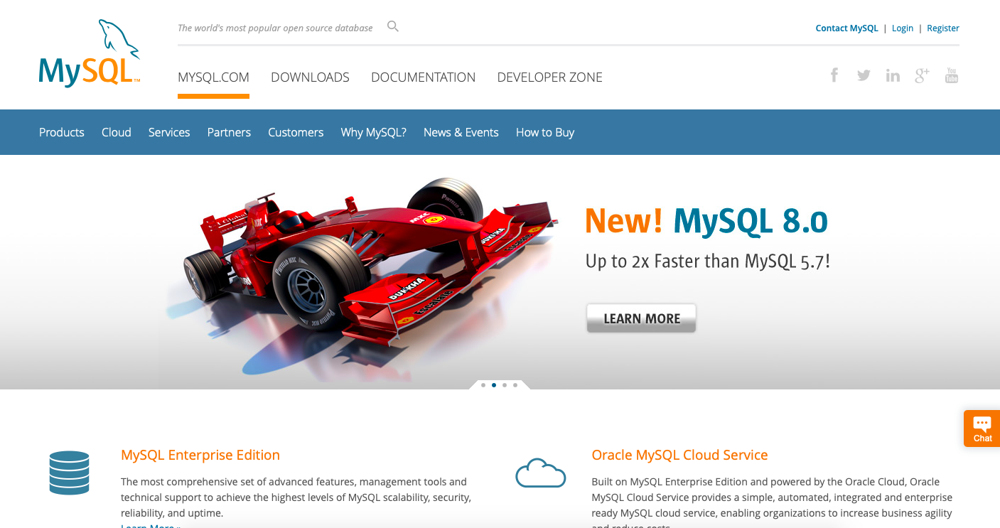
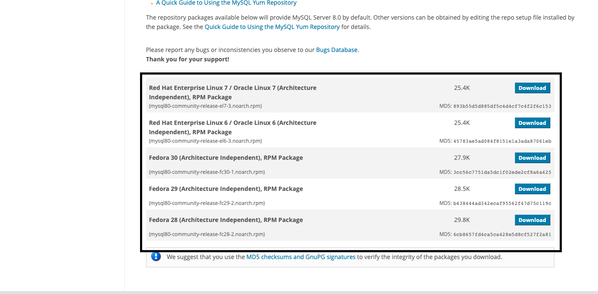
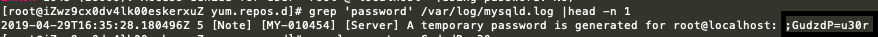

# Centos中安装mysql

1. 相信看到这里的小伙伴都是对 `linux` 的命令有一定的了解，这篇文章主要讲解怎么在`centos`中安装`mysql`
2. 首先检查系统中是否存在`mysql`  
    + `rpm -qa | grep mysql`
    + 如果你系统有安装，那可以选择进行卸载:  

        ```shell
        rpm -e mysql　　// 普通删除模式  
        rpm -e --nodeps mysql　　// 强力删除模式，如果使用上面命令删除时，提示有依赖的其它文件，则用该命令可以对其进行强力删除
        ```

3. 安装`mysql`
    + 在`centos`中我们可以选择用 `yum` 命令安装`mysql`
    + 安装前我们需要去[mysql](https://www.mysql.com)官网下载Yum资源包 [Yum Repository](https://dev.mysql.com/downloads/repo/yum/)
        + 

        + 

        + 下载方式  

            ```shell
            wget https://repo.mysql.com//mysql80-community-release-el7-3.noarch.rpm #或者 直接下载 
            ```

    + 安装刚才下载的`rpm`包 `rpm -ivh mysql80-community-release-el7-3.noarch.rpm`
    + 更新`yum` `yum update`
    + 安装`mysql-server` `yum install mysql-server`
    + 更改 `/var/lib/mysql` 目录权限为 `mysql:mysql` `chown mysql:mysql -R /var/lib/mysql`
    + 初始化 `mysql` `mysqld --initialize`
    + 启动 `mysql` `systemctl start mysqld`
    + 查看`mysql`的运行状态`systemctl status mysqld`
    + `mysql`为了增加数据库的安全性，在安装时会为`root`用户生成一个临时的随机密码，存放在`/var/log/mysqld.log` 中 (有些版本不需要可以直接登入 `mysql -uroot -p`)。
    + 查看临时密码 `grep 'password' /var/log/mysqld.log |head -n 1`
        + 

    + 登入mysql数据库`mysql -uroot -p`
    + 修改初始密码 `ALTER USER 'root'@'localhost' IDENTIFIED BY '密码';`
    + 如果你的密码可能会出现错误可以用如下方法修改
        + `set global validate_password_policy=0;` 密码政策
        + `set global validate_password_length=1;` 密码长度

4. 到这里`mysql`就安装完成了，当然你可以创建`mysql`远程登入账号
    + `create user 你的账号@'%' identified  by '你的密码';`
    + `grant all privileges on *.* to chenadmin@'%' with grant option;`
    + `flush privileges;`
    + `ALTER USER 你的账号@'%' IDENTIFIED WITH mysql_native_password BY '你的密码';`
    + 到别的主机试一下吧 `mysql -u你的账号 -p长度`
