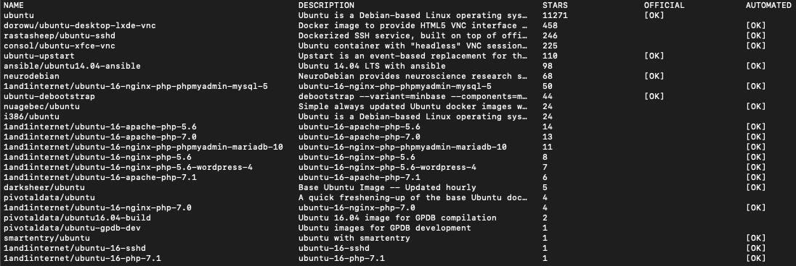

# Docker 安装 Ubuntu 并在其中安装 Hadoop

## 以下配置适用于 Hadoop r2.10.0

1. 下载 [Docker](https://www.docker.com/get-started)
2. 安装 `Ubuntu`
    + 查询 `ubuntu` `docker search ubuntu`

    

    + 下载官方版本的`Ubuntu` `docker pull ubuntu`
    + 查看刚才下载好的镜像 `docker images`

    

    + 运行刚才的`ubuntu`

        ```shell
        docker run -itd -p 50070:50070 -p 8088:8088 --name hadoop-ubuntu ubuntu
        ```

    + 查看容器 `id` `docker ps`

    

    + 通过 `/bin/bash` 进入容器 `docker exec -it 2659d1611a57(id)  /bin/bash`
  
3. 更新 `apt-get` `apt-get update`
4. 安装 `ssh` `apt-get install ssh`
5. 下载 `vim` 便于后续操作 `apt-get install vim`
6. 安装 `rsync` `apt-get install rsync`
7. 安装 `Java`
    + 在 [Oracle](https://www.oracle.com/java/technologies/javase-downloads.html) 下载`Java` 最低版本 `Java7` 我这里下载的是 `jdk-8u261-linux-x64.tar.gz` (需要登入，也可以在别的平台下载)
    + 刚才下载的 `Java` 复制到容器里面

        ```shell
        新建终端执行
        docker cp jdk-8u261-linux-x64.tar.gz 2659d1611a57:/opt  
        ```

    + 解压

        ```shell
        cd /opt
        tar -xzvf jdk-8u261-linux-x64.tar.gz
        ```

    + 配置环境变量

        ```shell
        vi /root/.bashrc
        
        export JAVA_HOME=/opt/jdk1.8.0_261
        export PATH=$PATH:$JAVA_HOME/bin
        
        source /root/.bashrc
        ```

    + 通过 `java -version` 验证是否安装成功

    

8. 安装 `Hadoop`
    + 下载 [Hadoop](https://mirrors.tuna.tsinghua.edu.cn/apache/hadoop/common/) 我下载的是 `hadoop-2.10.0.tar.gz`
    + 刚才下载的 `Hadoop` 复制到容器里面

        ```shell
        新建终端执行
        docker cp hadoop-2.10.0.tar.gz 2659d1611a57:/root
        ```

    + 解压

        ```shell
        cd /root/
        tar -xzvf hadoop-2.10.0.tar.gz 
        ```

    + 配置

        + hadoop-env.sh

            ```shell
            vi /root/hadoop-2.10.0/etc/hadoop/hadoop-env.sh
            
            export JAVA_HOME=/opt/jdk1.8.0_261 #(你自己的Java目录)
            ```

        + core-site.xml

            ```xml
            vi /root/hadoop-2.10.0/etc/hadoop/core-site.xml
            
            <configuration>
                <property>
                    <name>fs.defaultFS</name>
                    <value>hdfs://localhost:9000</value>
                </property>
            </configuration>
            ```

        + hdfs-site.xml

            ```xml
            vi /root/hadoop-2.10.0/etc/hadoop/hdfs-site.xml
            
            <configuration>
                <property>
                    <name>dfs.replication</name>
                    <value>1</value>
                </property>
            </configuration>
            ```

        + 配置 `ssh`

            ```shell
            ssh-keygen -t rsa -P '' -f ~/.ssh/id_rsa
            cat ~/.ssh/id_rsa.pub >> ~/.ssh/authorized_keys
            chmod 0600 ~/.ssh/authorized_keys
            
            # 开启 ssh /etc/init.d/ssh start
            ```

        + mapred-site.xml

            ```xml
            cp /root/hadoop-2.10.0/etc/hadoop/mapred-site.xml.template /root/hadoop-2.10.0/etc/hadoop/mapred-site.xml
            vi /root/hadoop-2.10.0/etc/hadoop/mapred-site.xml
            
            <configuration>
                <property>
                    <name>mapreduce.framework.name</name>
                    <value>yarn</value>
                </property>
            </configuration>
            ```

        + yarn-site.xml

            ```xml
            vi /root/hadoop-2.10.0/etc/hadoop/yarn-site.xml
            
            <configuration>
                <property>
                    <name>yarn.nodemanager.aux-services</name>
                    <value>mapreduce_shuffle</value>
                </property>
            </configuration>
            ```

        + namenode 格式化

            ```shell
            /root/hadoop-2.10.0/bin/hdfs namenode -format
            ```

    + 添加环境变量

        ```shell
        vi /root/.bashrc
        
        export HADOOP_HOME=/root/hadoop-2.10.0
        export PATH=$PATH:$HADOOP_HOME/bin:$HADOOP_HOME/sbin
        
        source /root/.bashrc
        ```

    + 开启 `dfs` `yarn`

        ```shell
        start-dfs.sh
        start-yarn.sh 
        ```

9. 测试
    + `hdfs` 测试

        ```shell
        # 列出根目录下所有的目录或文件 
        hdfs dfs -ls /
        # 新建一个文件 
        echo "hello hadoop word" >> hello_hadoop
        # 上传数据到'hdfs' 
        hdfs dfs -put hello_hadoop /
        # 列出根目录下所有的目录或文件 
        hdfs dfs -ls /
        ```

    + `yarn` 测试

        ```shell
        # 运行 pi 测试程序
        yarn jar /root/hadoop-2.10.0/share/hadoop/mapreduce/hadoop-mapreduce-examples-2.10.0.jar pi 5 5
        ```

    + 通过网页查看 `yarn` 和 `hdfs`

        ```
        http://127.0.0.1:8088/
        http://127.0.0.1:50070/
        ```
