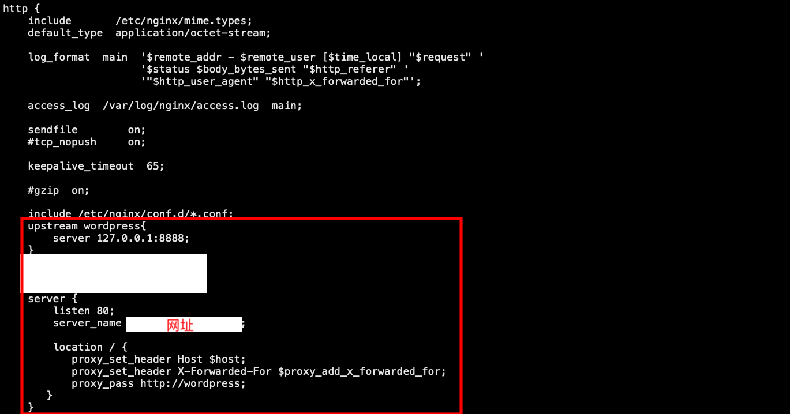
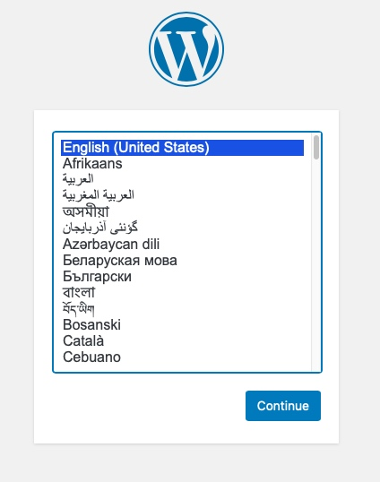
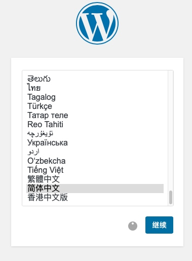
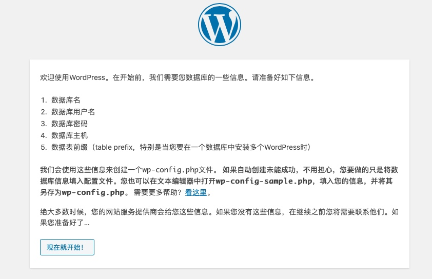
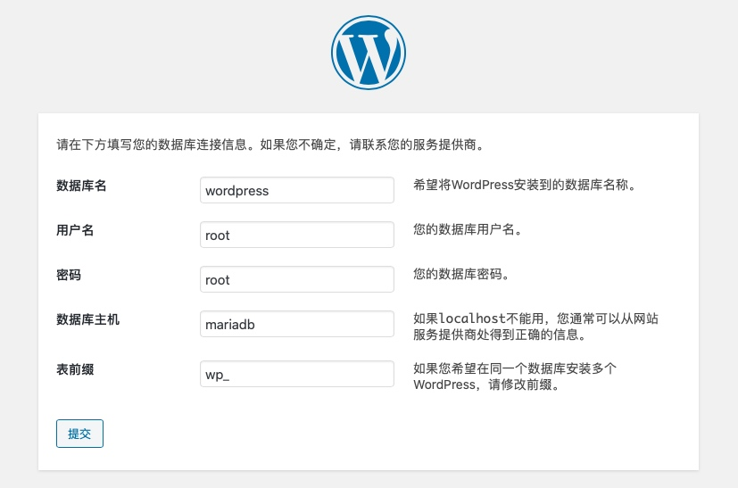
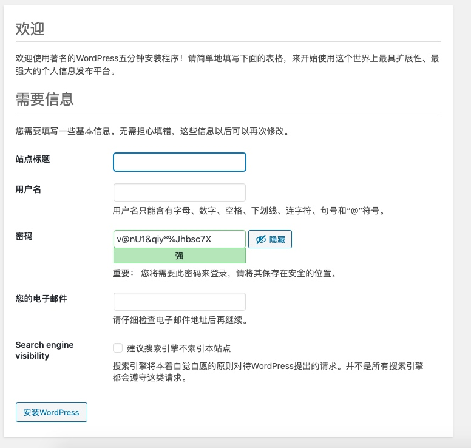

# Docker 搭建 WordPress

1. 下载 `Docker`
2. 下载 `wordpress` `docker pull wordpress`
3. 下载 `nginx` (用于反向代理，便于后面启动多个应用) `docker pull nginx`
4. 下载 `mariadb` `docker pull mariadb`
5. 运行 `mariadb`

    ```shell
    docker run --name mariadb -p 3307:3306 -e MYSQL_ROOT_PASSWORD=root -d mariadb
    3307是映射的本地端口防止和本地数据库冲突
    MYSQL_ROOT_PASSWORD数据库密码
    ```

    + 配置数据库

        ```shell
        docker exec -it mariadb /bin/bash
        进入容器内部
        mysql -uroot -proot
        create database wordpress;
        exit
        退出容器
        exit
        ```

6. 运行 `wordpress`

    ```shell
    docker run --name wordpress --link mariadb:mariadb -p 8888:80 -d wordpress
    
    # 8888是映射的本地端口之所以不用80端口是为了便于后面 一台机器启动多个应用然后通过nginx反向代理
    
    # --link 连接数据库 可以在此容器内通过 mariadb 访问刚才建的数据库
    ```

7. 运行 `nginx`

    + 启动测试 `nginx` 便于通过命令 `cp` 配置文件

        ```shell
        docker run -d --name test-nginx nginx
        ```

    + 新建文件夹并copy nginx配置文件到本地

        ```shell
        mkdir /usr/local/nginx
        mkdir /usr/local/nginx/www
        mkdir /usr/local/nginx/conf
        mkdir /usr/local/nginx/logs
        docker cp test-nginx:/etc/nginx/nginx.conf /usr/local/nginx/conf/nginx.conf  
        ```

    + 删除测试 `nginx`

        ```shell
        docker stop test-nginx 
        docker rm test-nginx 
        ```

    + 启动

        ```shell
        docker run -d -p 80:80 --name nginx -v /usr/local/nginx/www:/usr/share/nginx/html -v /usr/local/nginx/conf/nginx.conf:/etc/nginx/nginx.conf -v /usr/local/nginx/logs:/var/log/nginx --network host nginx
        ```

8. 配置 `nginx`
    + 打开 `nginx.conf`

        ```shell
        vi /usr/local/nginx/conf/nginx.conf
        ```

    + 添加以下配置到 `http` 里面

        ```nginx
        upstream wordpress{
            server 127.0.0.1:8888;
        }
        server {
            listen 80;
            server_name 网址;

            location / {
            proxy_set_header Host $host;
            proxy_set_header X-Forwarded-For $proxy_add_x_forwarded_for;
            proxy_pass http://wordpress;
        }
        }
        ```

    

    + 重启 `nginx`

        ```shell
        docker stop nginx
        docker start nginx
        ```

9. 配置 `wordpress`
    + 通过刚才配置的网址访问 `wordpress` 如果你没有启用`nginx` 可以通过 127.0.0.1:刚才映射的端口访问

    

    + 选择语言 我选择的是中文

    

    + 配置数据库
        + 点击现在就开始

        

        + 填写数据库信息

        

        + 提交

        

        + 到现在就基本安装好 `wordpress`了 你可以根据自己的实际需求填写相关信息了

        
