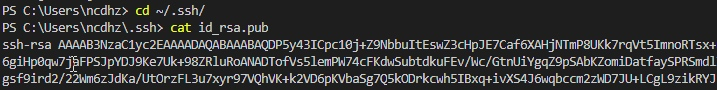
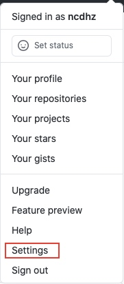
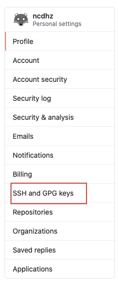
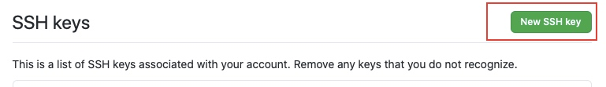
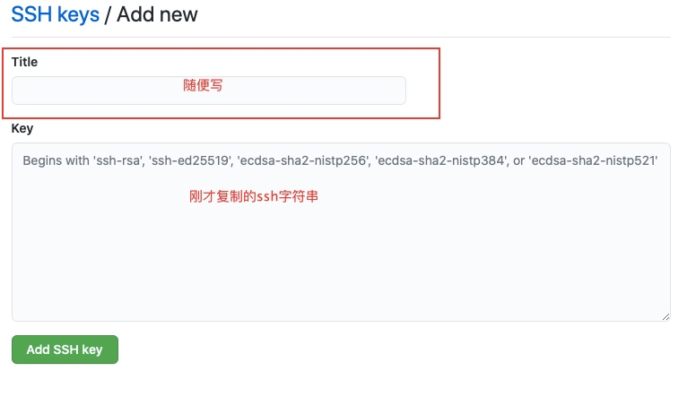

# Git 关联远端仓库

1. 首先安装 `Git`
2. 创建一个密匙

    ```shell
    ssh-keygen -t rsa -C "example@mail.com"
    ```

3. 拷贝密匙

    ```shell
    cd ~/.ssh/
    cat id_rsa.pub
    // copy 输出内容
    ```

    

4. 打开远程 `Github` 仓库按一下操作
    + 打开全局设置

    

    + 打开 `SSH and GPG keys`

    

    + 新建 `SSH`

    

    + 填写基本信息

    

    + 保存

5. 克隆你的项目

    ```shell
    git clone git@github.com:example.git 
    ```

6. 验证是否关联成功

    ```shell
    ssh -T git@github.com
    ```

7. 输入邮箱和用户名

    ```shell
    git config --global user.email "example@mail.com"
    git config --global user.name "name"
    ```
