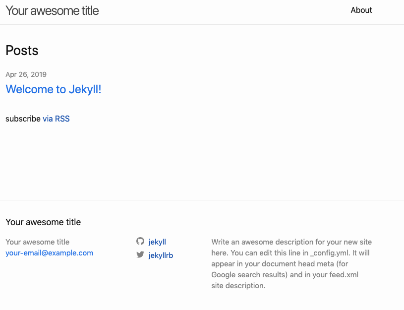
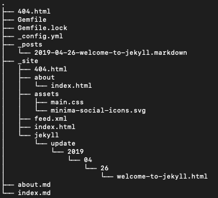
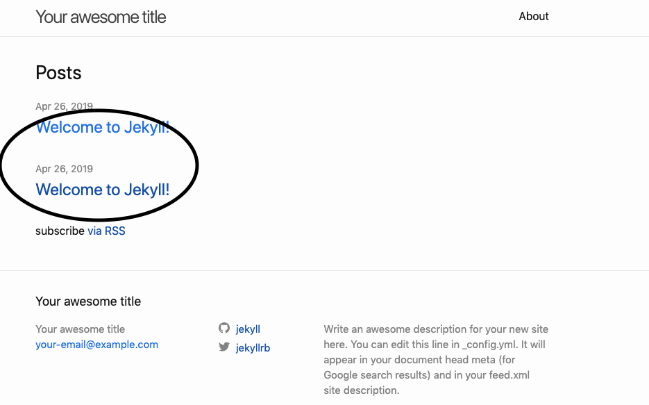
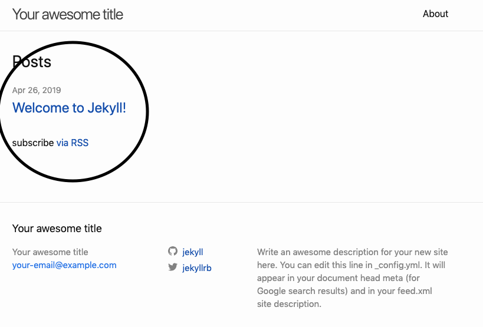

# jekyll 简述

1. 简介：jekyll 是一个将纯文本转换为静态网站和博客的框架，github默认支持。
   + [简单](https://www.jekyll.com.cn/docs/usage/)：无需数据库、评论功能或频繁的版本更新—只需关注你的内容。
   + [静态](https://www.jekyll.com.cn/docs/liquid/)：只用 Markdown、Liquid、HTML & CSS g就可以构建可部署的静态网站。
   + [博客](http://import.jekyllrb.com/)：原生支持自定义链接、分类、静态页、文章以及自定义布局。

2. 快速入门
    + 安装一个完整的[Ruby 开发环境](https://www.jekyll.com.cn/docs/installation/)
    + 安装 Jekyll 和 bundler gems ` gem install jekyll bundler `
    + 创建一个全新的 Jekyll 网站

        ```shell
        # 方法一 
        jekyll new myblog
        ```

        ```shell
        #方法二  
        mkdir myblog  
        cd myblog  
        jekyll new . 
        ```

    + 进入新创建的目录
        + `方法一 cd myblog`
        + ` 方法二 或者直接是当前目录 `
    + 构建网站并启动一个本地 web服务
        + ` bundle exec jekyll serve 有的机器需要管理员权限 (sudo bundle exec jekyll serve) `
    + 在浏览器中打开 [http://localhost:4000](http://localhost:4000) 网址就可以一睹 jekyll 的庐山真面目了

    

3. 如果在上一步过程中遇到错误请确定 [Ruby 开发环境](https://www.jekyll.com.cn/docs/installation/) 安装没有问题，如果还是遇到问题请移步 [故障排除](https://www.jekyll.com.cn/docs/troubleshooting/#configuration-problems)
4. 到这里我们已经对 [jekyll](https://www.jekyll.com.cn/) 有了一个简单的印象了接着我们就新建一个自己的静态页面吧
    + 我们先看一下 [jekyll](https://www.jekyll.com.cn/) 的目录结构

    

    + 首先我们了解一下 [jekyll](https://www.jekyll.com.cn/) 的配置文件 `_config.yml` 中的最基本的几个设置

        ```
        title: 这个静态网站的title
        email: 你的电子邮件地址
        description: 网站的描述
        baseurl: host:port:/baseurl
        url: 网站对应的网址
        twitter_username: twitter的名字
        github_username: github的名字
        ```

    + 接着我们进入主题:新建一个自己的静态页面

        ```shell
        cd _posts  
        cp 2019-04-26-welcome-to-jekyll.markdown 2019-04-26-welcome-to-jekyll_1.markdown
        ```

        + 到这里我们已经新建了自己的一张自己的页面了如下：

            

        + 也就是说我们只要在 ` _posts ` 这个文件夹下新建 `markdown` 文件 `jekyll`就会给我们自动加载 (当然这是错的)

            ```shell
            mv 2019-04-26-welcome-to-jekyll_1.markdown 1.markdown
            ```

        

        发现刚才我们新建的静态网页消失了，原来jekyll文件是有固定的格式的 **年-月-日-文件名**

        + 现在我们打开刚才新建的`markdown`的文件`vi 2019-04-26-welcome-to-jekyll_1.markdown` 很明显就可以看出上面`---` 开头`---`结尾的部分是对这个文档的描述
            
            ```
            layout: 文件处理方式
            title: 文件的title
            date: 时间
            categories: 类别
            # 接着就是静态页面的正文部分支持` markdown `的语法（自行研究markdown的语法）
            ```

5. 说到这里相信各位小伙伴都会新建` jekyll `的静态页面了吧，接下来我们了解一下` jekyll `的主题。（毕竟jekyll初始化的主题不能满足所有人的需要）
6. 推荐一个网站[Jekyll Themes](http://jekyllthemes.org/)里面有很多 jekyll 的主题各位小伙伴可以去寻找自己喜欢的样式了。然后下载下来`bundle exec jekyll serve`运行它，每一个主题都有自己特定的一些规范各位小伙伴可以自行了解，我会向大家介绍其中的一个主题也就是本博客使用的主题 `jekyll-TeXt-theme`
