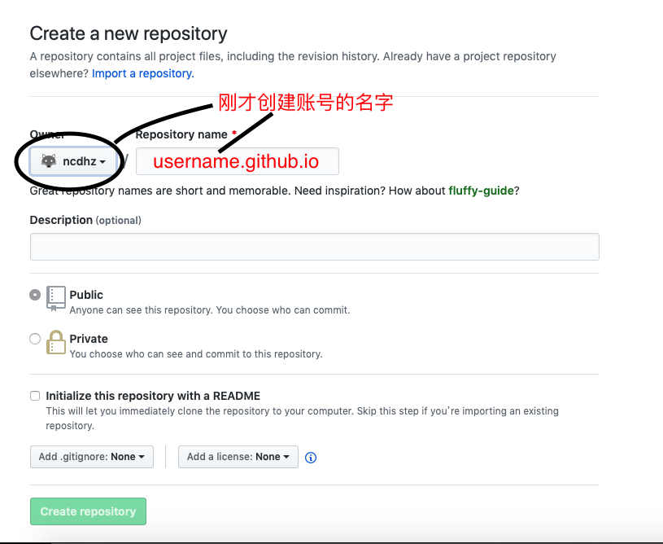
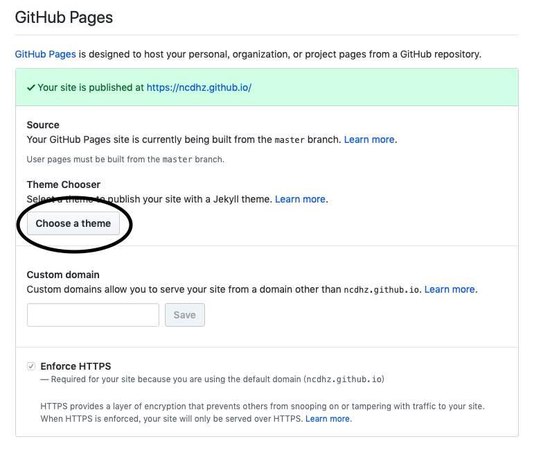

# username.github.io 博客简述

1. 来到这里的小伙伴应该多半是被 `username.github.io`这样的域名吸引或者想建`username.github.io`这样域名的博客
2. 我们先讲讲`username.github.io`这种域名的来历。
    + [github](https://baike.baidu.com/item/github) 大家应该都知道吧。
    + `username.github.io`这种域名是`github`提供的一个服务 [github pages](https://pages.github.com) 提供的， [github pages](https://pages.github.com) 是一个可以用于建立博客的github的服务。
3. 开始`github pages`的旅程
    + 新建一个 [github](https://github.com/join) 账号（拥有的不用新建）
    + 新建一个 repository  

    

    + 进入刚才创建的 repository 设置界面找到：  

    

    点击按钮选择自己喜欢的主题
      

    + 打开浏览器输入 `username.github.io` 。恭喜你，你的博客就这样完成了。
    + 你现在就可以通过 [git](/2019/12/03/git基础/) 来操作你的博客了。

4. 当然到这里本博客还没有结束。首先我们得思考一个问题，难道除了 github 给的那几个默认的主题，不能有别的主题吗，github pages 的扩展性应该不会这么差吧？当然还有别的主题了。
    + 大家先去看我的另一篇博客 `Jekyll`了解一下。
    + 从那篇博客我们可以很明显的知道`Jekyll`是一个制作静态页面的工具，这个工具可以用来做博客，用来开发静态网站。
    + 不难知道 github 对那个插件默认支持，那么我们就在github中使用一下它。
        + 首先下载 `Jekyll` 具体下载方法移步 (`Jekyll`)
        + 然后上传本地的 `Jekyll` 到`username.github.io` 这个 repository
        + 最后访问 `username.github.io` 这个网址，是不是惊奇的发现现在 `github pages` 的主题改了，改成 `Jekyll` 的主题了。
        + 我们还可以使用 `Jekyll` 其他的主题按照同样的方法进行处理如：`jekyll-TeXt-theme`

5. 最后祝大家能写出好的博客。
