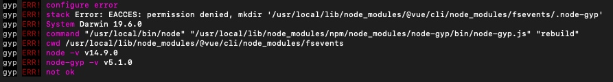

# Mac 中 npm 全局下载权限问题

在Macbook中使用npm下载的时候可能会遇到权限问题而报错首先可以尝试下面的解决办法

```shell
sudo npm install -g 包
```

有些问题用上面的方式也解决不了比如：下载 `@vue/cli` 这个包下载的途中需要新建文件夹，而新建文件夹使用的命令是 `mkdir` 所以就会没有权限。可以尝试下面的解决方案。



```shell
# 这个.npm-global 名字可以用你自己喜欢的名字替换，
# 推荐直接使用这个名字。
mkdir ~/.npm-global

# 第二步：更改node的安装连接
npm config set prefix '~/.npm-global'

# 第三步：打开编辑.bash_profile文件
open -e .bash_profile

# 第四步：在用户的profile下增加path，为的是系统能够找到可执行文件的目录
export PATH=~/.npm-global/bin:$PATH

# 第五步：保存文件，关闭.bash_profile

# 第六步：更新刚配置的环境变量，在终端输入
source .bash_profile

# 如果你用的是 zsh 从第三步开始改成
open -e .zshrc
#  第六步改成 
source .zshrc
```
