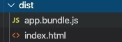

# Webpack 基础配置

1. 新建目录 `mkdir demo`
2. 进入目录 `cd demo`
3. 初始化项目 `npm init -y`
4. 安装`webpack`和`webpack-cli` `npm install webpack webpack-cli --save-dev`
5. 安装`html-webpack-plugin`用于自动生成首页 `npm install --save-dev html-webpack-plugin`
6. 安装`clean-webpack-plugin`用于清理`dist`目录 `npm install clean-webpack-plugin --save-dev`
7. 新建`src`目录 `mkdir src`
8. 新建`index.js` `cd src``touch index.js`
9. 新建配置文件`webpack.config.js` `cd ..` `touch webpack.config.js`
10. 添加配置

    ```js
    const path = require('path');
    const HtmlWebpackPlugin = require('html-webpack-plugin');
    const { CleanWebpackPlugin } = require('clean-webpack-plugin');
    module.exports = {
        entry: {
            app: './src/index.js',
        },
        plugins:[
            new CleanWebpackPlugin(),
            new HtmlWebpackPlugin({title: 'Demo'})
        ],
        output: {
            filename: '[name].bundle.js',
            path: path.resolve(__dirname, 'dist'),
        },
        // 用于剔除代码压缩包
        optimization:{
          minimize: false,
        } 
      };
    ```

11. 在`package.js`的`scripts`中添加 `"build": "webpack"`
12. 在终端执行`npm run build` 查看目录结构会发现多了一个`dist`目录，目录里面多了一些文件，到这里可以说基本构建了`webpack`。


