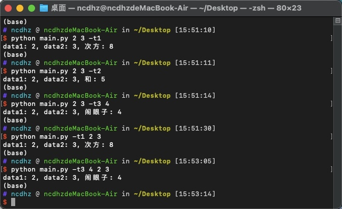

# Argparse 入门

## Argparse 介绍

此模块是Python标准库中推荐的命令行解析模块（几乎所有的语言都有自己的命令行解析模块——有些是以别的方式存在）。

## Argparse 第一个小例子

下面已经编写好了第一个Python命令行程序了虽然没有添加任何的功能但是也不妨碍使用

```python
# 添加如下代码在 `main.py` 文件中
import argparse
parser = argparse.ArgumentParser()
parser.parse_args()
```

> 测试上面的例子


可以看到上面的测试结果，直接执行程序没有任何输出，添加 `-h` 参数时输出的是选项信息，而输出没有定义的参数时输出的是错误信息（也就是参数必须是已经定义好的）

### Argparse 基本功能介绍

1. 位置参数
    + 替换如下代码

        ```python
        import argparse
        parser = argparse.ArgumentParser()
        parser.add_argument('echo')
        args = parser.parse_args()
        print(args.echo, type(args.echo))
        ```

    + 结果
        从下面结果中可以清晰地看到第一条执行语句报错了（下面语句很符合人对命令行的第一印象），这也间接的说明了现在这个程序监听的是位置参数。也就是如第二条语句一样只需要在合适的位置输入参数就好了不需要带前面的标签。
        > 观察下面输出的类型是不是已经发现了输出的都是str这个问题下面来解决

        

    + `add_argument` 函数的参数

        ```python
        import argparse
        parser = argparse.ArgumentParser()
        parser.add_argument('echo', type=int, help='echo 必须是整数')
        args = parser.parse_args()
        print(args.echo, type(args.echo))
        ```

    + 添加参数后的结果
        从下面的结果可以看出输入的参数必须是整数，这就是上面的 `type=int` 起了效果。用 help 查询时可以看见echo的帮助信息，这就是 `help=''` 起了效果。

        

2. 可选参数
    可选参数顾名思义就是可有可无的意思下面将写一个完整的可选参数的例子然后讲解
    + 例子

        ```python
        import argparse
        parser = argparse.ArgumentParser()
        parser.add_argument('--test1', help='测试1')
        parser.add_argument('-t2', '--test2', help='测试2')
        parser.add_argument('-t3', '--test3', type=int, help='测试3')
        parser.add_argument('-t4', '--test4', action='store_true', help='测试4')
        args = parser.parse_args()
        print(args)
        ```

    + 结果
        如下图所示，首先执行的是一个 `help` 命令，显示出了有多少个参数可以选择，并且告诉了每个参数该怎么使用。接着第二条命令是为了解释 `help` 中 `--test1 TEST1` 是什么意思，也就是 `--test1` 后面必须添加一个参数（可以对照代码理解每个参数的含义）。第三条和第四条语句是为了显示后面添加的参数类型可以是任何不过都会被解析成str类型。第五条语句是为了显示起一个别名的意思，也就是 `--test2` 太长了，可以用 `-t2` 来显示。第六条和第七条语句说明当指定类型时输入的参数必须是和指定类型相同。第八条和第九条语句对应上面 `parser.add_argument('-t4', '--test4', action='store_true', help='测试4')` 这条代码，其中添加了 `action` 参数，并给了 `store_true` 这个值。`action='store_true'` 有两个含义，其一是后面不用加参数，其二是当命令中没有使用此参数时默认输出值为 `False` 当使用此参数时输出值为 `True`

        

3. 动作 `count`
    + 替换如下代码

        ```python
        import argparse
        parser = argparse.ArgumentParser()
        parser.add_argument('-t', '--test', action='count')
        args = parser.parse_args()
        print(args)
        ```

    + 结果
        如上代码修改了 `action='count'`，可见下面的结果就是统计这个参数出现了几次当出现 `0` 此时输出的是 `None`

        

4. 默认值

    + 代码

        ```python
        import argparse
        parser = argparse.ArgumentParser()
        parser.add_argument('-t', '--test', action='count', default=0)
        args = parser.parse_args()
        print(args)
        ```

    + 结果
        如上代码添加了 `default=0` 参数，得到的效果是当一次没有 `-t` 参数时输出的不是 `None` 了而是 `0` 也就是刚才设置了默认值

        

5. 互斥选项
    互斥选项也就是当出现我时你就不要出现了，就相当于单选永远只能出现一个
    + 代码

        ```python
        import argparse
        parser = argparse.ArgumentParser()
        # 如下互斥选项需要一个包裹函数
        group = parser.add_mutually_exclusive_group()
        group.add_argument('-t1', '--test1', action='store_true')
        group.add_argument('-t2', '--test2', action='store_true')
        
        args = parser.parse_args()
        print(args)
        ```

    + 结果
        如下图所示，当指定互斥选项时能够出现在命令行的参数只能是其中之一或者都不出现，如果出现多个参数就会报错

        

### 结合上述内容的总例子

1. 代码

    ```python
    import argparse
    parser = argparse.ArgumentParser(description='这是一个总例子')
    
    group = parser.add_mutually_exclusive_group()
    # 用于指定是求次方
    group.add_argument('-t1', '--test1', action='store_true')
    # 用于指定求和
    group.add_argument('-t2', '--test2', action='store_true')
    # 闹眼子的参数当上面都没有选择时执行
    parser.add_argument('-t3', '--test3', type=int)
    # 数据1
    parser.add_argument('data1', type=int)
    # 数据2
    parser.add_argument('data2', type=int)
    args = parser.parse_args()
    # 判断那个参数为真并输出对应的结果
    if args.test1 :
        print('data1: {}, data2: {}, 次方: {}'.format(args.data1, args.data2, args.data1 ** args.data2))
    elif args.test2:
        print('data1: {}, data2: {}, 和: {}'.format(args.data1, args.data2, args.data1 + args.data2))
    else:
        print('data1: {}, data2: {}, 闹眼子: {}'.format(args.data1, args.data2, args.test3))
    ```

2. 结果
    下图只需要注意一点：
    > "位置参数"和"可选参数"的位置可以换动如第四和第五条语句

    
