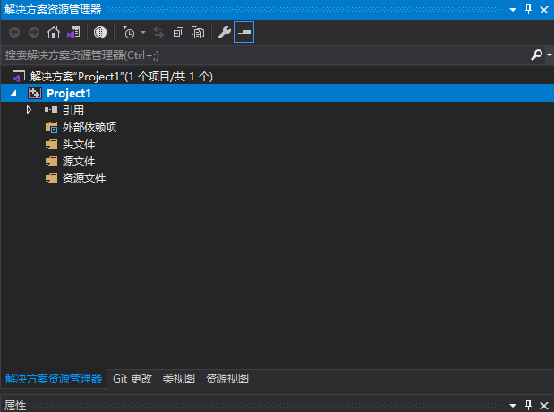
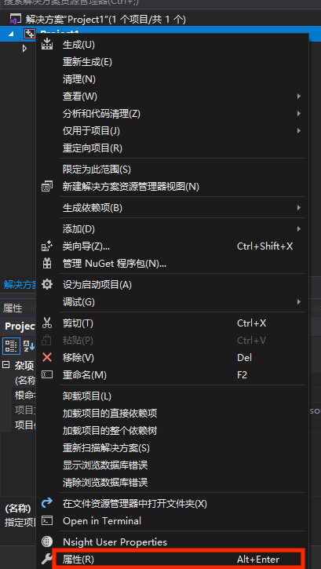
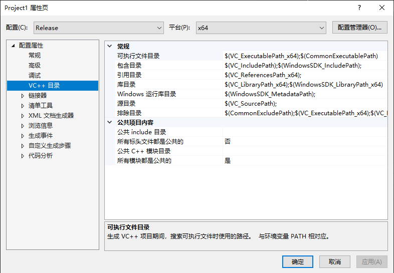
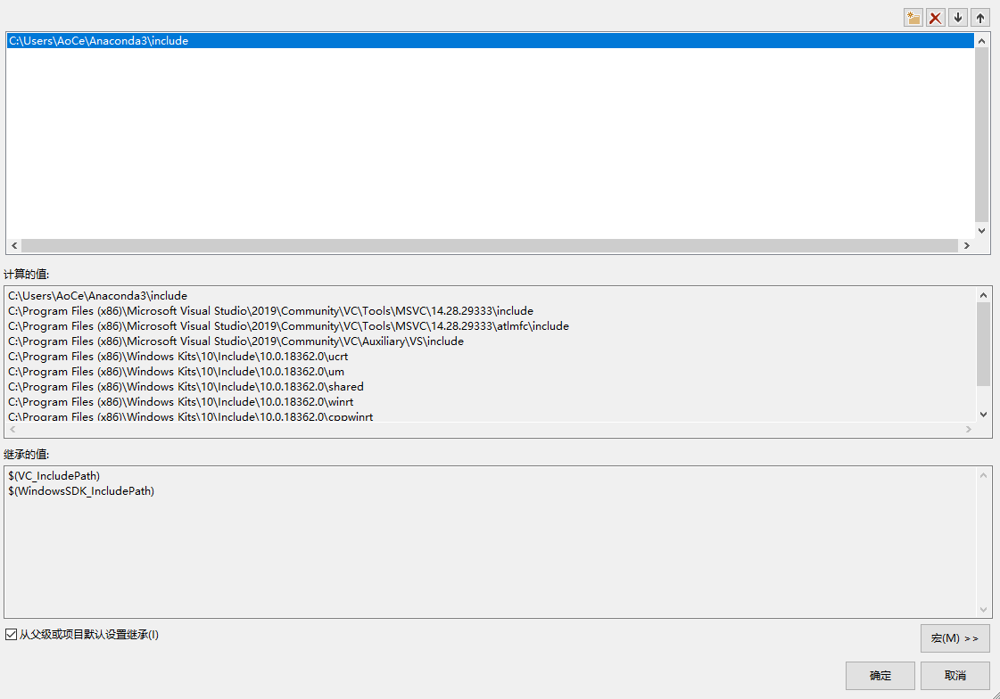
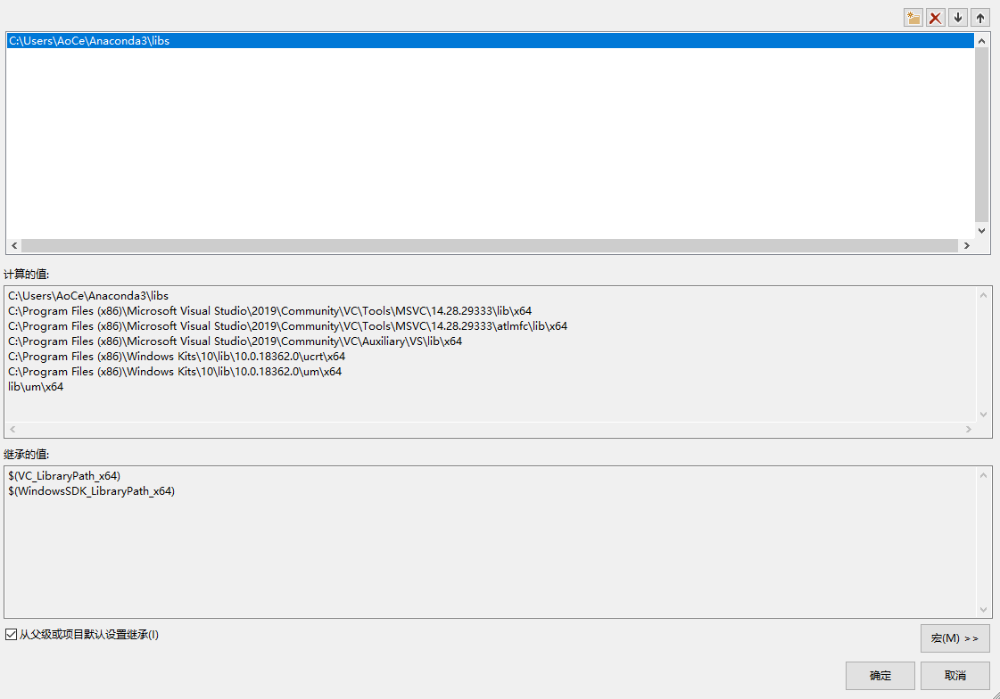
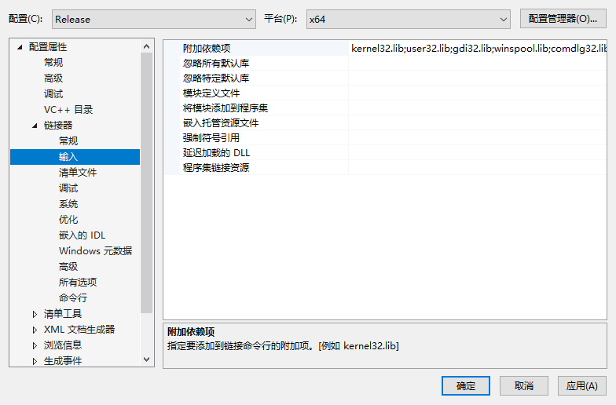
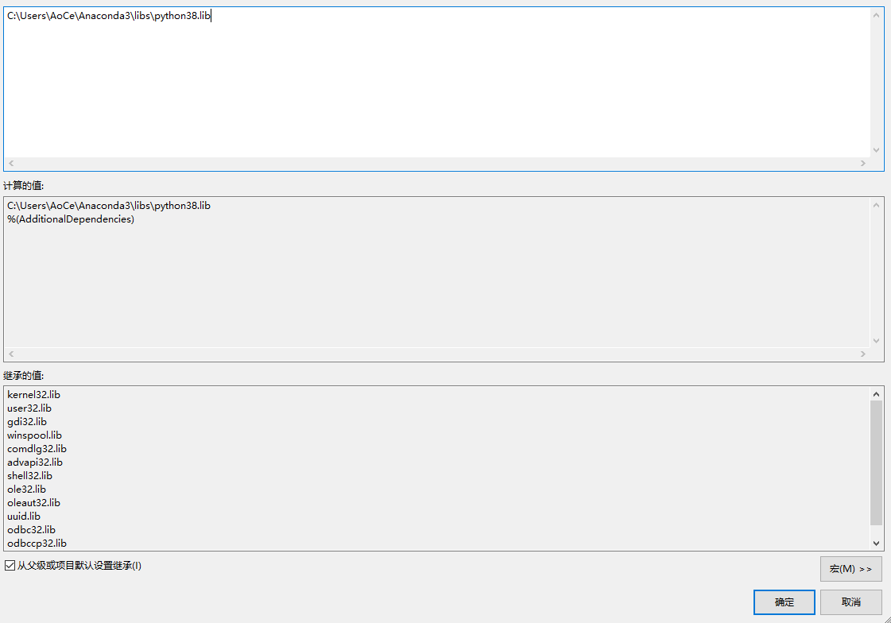

# C++ 调用 Python

## 在 Windows 10 的 VS 2019 中配置环境

1. 创建一个空项目

2. 打开项目的属性

    

    

3. 找到 VC++ 目录

    

4. 找到`包含目录`添加 Python 的 include 目录的路径

    

5. 找到`库目录`添加 Python 的 libs 目录的路径

    

6. 打开 `链接器` `输入` `附加依赖项` 添加 python lib文件路径（也就是 `libs` 目录下的python38.lib）

    

    
