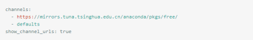
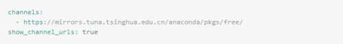
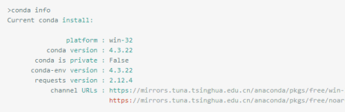

# Conda 配置源

1. 下面介绍的是配置清华源

    ```shell
    清华源地址：
    https://mirrors.tuna.tsinghua.edu.cn/anaconda/pkgs/main/
    https://mirrors.tuna.tsinghua.edu.cn/anaconda/pkgs/free/
    https://mirrors.tuna.tsinghua.edu.cn/anaconda/cloud/conda-forge/
    https://mirrors.tuna.tsinghua.edu.cn/anaconda/cloud/bioconda/
    ```

2. 打开终端执行下面命令

    ```shell
    conda config --add channels https://mirrors.tuna.tsinghua.edu.cn/anaconda/pkgs/main/
    conda config --add channels https://mirrors.tuna.tsinghua.edu.cn/anaconda/pkgs/free/
    conda config --add channels https://mirrors.tuna.tsinghua.edu.cn/anaconda/cloud/conda-forge/
    conda config --add channels https://mirrors.tuna.tsinghua.edu.cn/anaconda/cloud/bioconda/
    conda config --set show_channel_urls yes
    ```

3. 找到`.condarc` 文件，在用户目录下

    ```shell
    // linux 在如下地方
    vi ~/.condarc
    ```
    
    

4. 删除`第三行`然后保存

    

5. 执行 `conda info`查看是否成功，关注`channel URLs`字段内容

    
