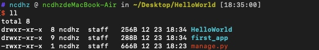
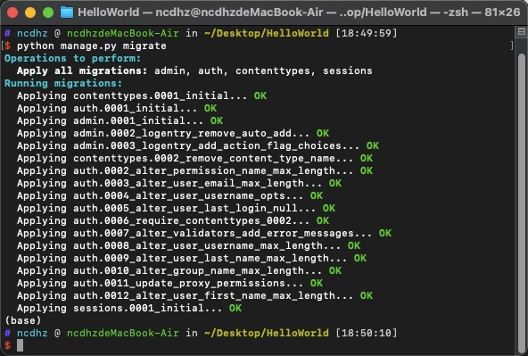
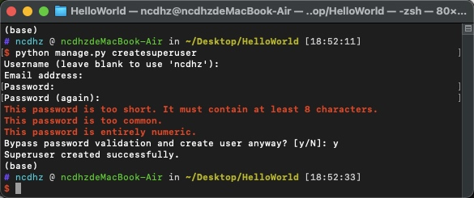
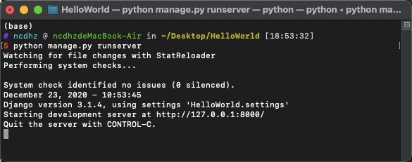
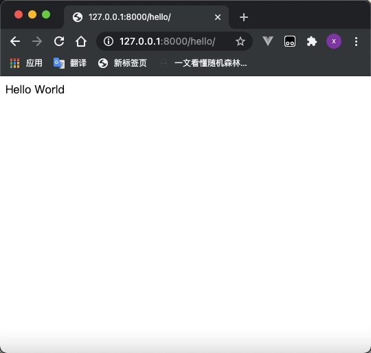
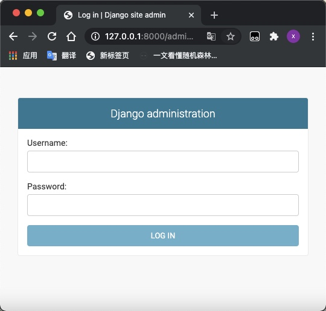
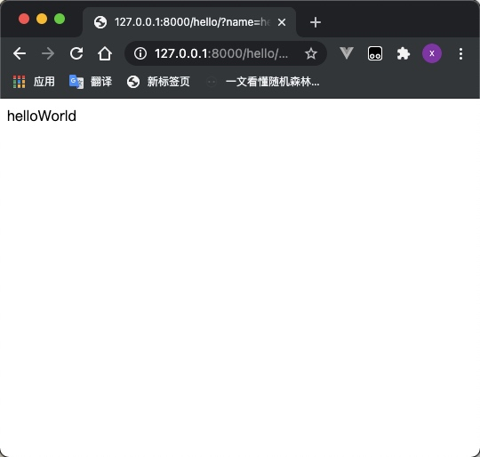
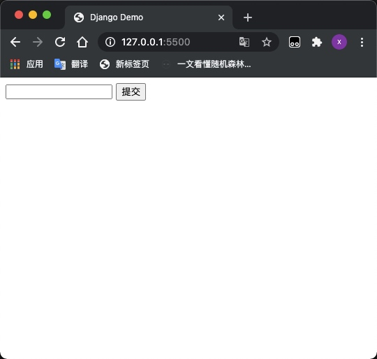
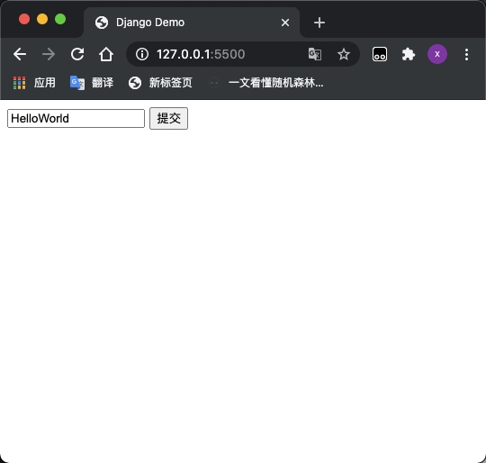
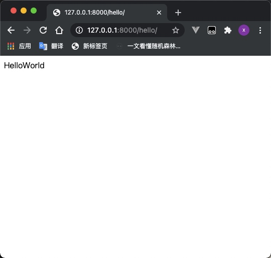

# Django 入门

## Django介绍

Django是Python下的一款重量级的Web应用框架，现在有很多成功的网站都是基于Django开发的，所以这是一款值得你选择的框架。

## Django 的 HelloWorld

1. 安装Django

    ```shell
    pip install Django
    ```

2. 通过以下命令创建第一个应用

    ```shell
    django-admin startproject HelloWorld
    ```

3. HelloWorld 文件夹中各个文件的作用

    | manage.py              | 用于与Django交互如：启动Djan             |
    |------------------------|:-------------------------------:|
    | HelloWorld/__init__.py | 告诉 Python 该目录是一个 Python 包       |
    | HelloWorld/asgi.py     | 一个 ASGI 兼容的 Web 服务器的入口，以便运行你的项目 |
    | HelloWorld/settings.py | 设置/配置                           |
    | HelloWorld/urls.py     | URL 声明; 一份由 Django 驱动的网站"目录"    |
    | HelloWorld/wsgi.py     | 一个 WSGI 兼容的 Web 服务器的入口，以便运行你的项目 |

4. 新建APP

    ```shell
    # 在 HelloWorld目录下和 manage.py 同级
    python manage.py startapp first_app
    ```

    

5. 编写第一个请求处理函数和配置url
    + 更改 `first_app/views.py` 文件如下

        ```python
        from django.http import HttpResponse

        def hello(request):
            return HttpResponse('Hello World')
        ```

    + 更改 `HelloWorld/urls.py` 文件如下

        ```python
        from django.contrib import admin
        from django.urls import path
        from first_app import views
        urlpatterns = [
            path('admin/', admin.site.urls),
            path('hello/', views.hello),
        ]
        ```

6. 生成数据库并创建管理员用户

    ```shell
    # 在 HelloWorld目录下和 manage.py 同级
    # 将生成的py文件应用到数据库
    python manage.py migrate
    ```

    

    ```shell
    # 创建管理员用户
    python manage.py createsuperuser
    ```

    

7. 运行项目

    ```shell
    python manage.py runserver  
    ```

    

    + 打开编写的接口 [127.0.0.1:8000/hello](127.0.0.1:8000/hello)

        

    + 打开管理员地址 [127.0.0.1:8000/admin](127.0.0.1:8000/admin)

        ```shell
        # 以下的密码账号就是刚才创建的管理员密码和账号
        ```

        

8. get请求处理
    + 更改 `first_app/views.py` 文件如下

        ```python
        def hello(request):
            return HttpResponse(request.GET['name'] if request.GET else '请提供name参数')
        ```

    + 运行链接 [http://127.0.0.1:8000/hello/?name=helloWorld](http://127.0.0.1:8000/hello/?name=helloWorld)

        

9. post请求处理
    + 更改 `first_app/views.py` 文件如下

        ```python
        def hello(request):
            return HttpResponse(request.POST['name'] if request.POST else '请提供name参数')
        ```

    + 注解 `HelloWorld/settings.py` 中如下代码

        ```python
        MIDDLEWARE = [
            'django.middleware.security.SecurityMiddleware',
            'django.contrib.sessions.middleware.SessionMiddleware',
            'django.middleware.common.CommonMiddleware',
            # 'django.middleware.csrf.CsrfViewMiddleware',
            'django.contrib.auth.middleware.AuthenticationMiddleware',
            'django.contrib.messages.middleware.MessageMiddleware',
            'django.middleware.clickjacking.XFrameOptionsMiddleware',
        ]
        ```

    + 在当前目录下新建页面 `index.html` 添加代码如下

        ```html
        <!DOCTYPE html>
        <html lang="en">
        <head>
            <meta charset="UTF-8">
            <meta name="viewport" content="width=device-width, initial-scale=1.0">
            <title>Django Demo</title>
        </head>
        <body>
            <form method="POST" action="http://127.0.0.1:8000/hello/">
                <input type="text" name="name"/>
                <input type="submit">
            </form>
        </body>
        </html>
        ```

    + 用浏览器打开 `index.html`

        

    + 输入 HelloWorld 提交

        

        
