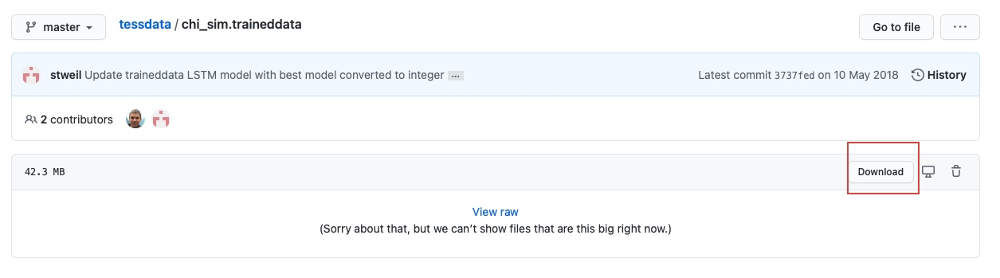
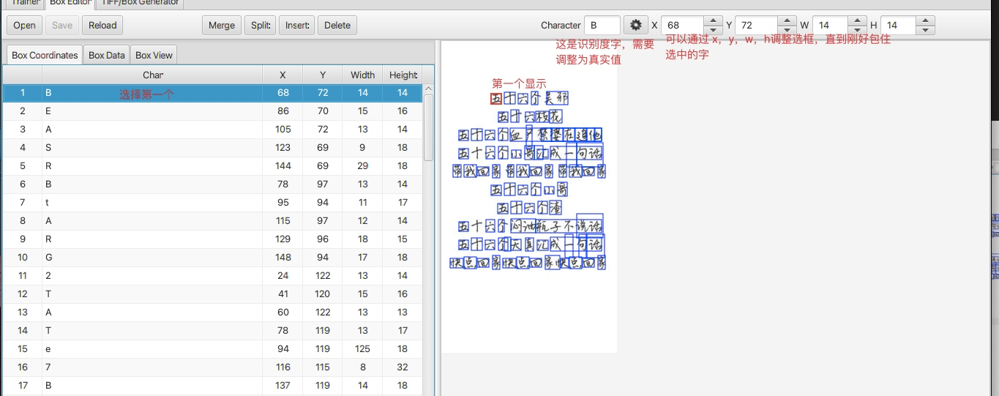
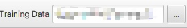
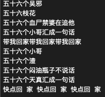
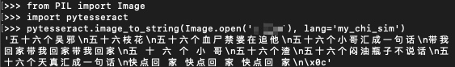

# Mac 使用 tesseract-OCR

1. 安装 [brew](https://brew.sh/) 工具
2. 下载编译 `tesseract` 需要的环境

    ```bash
    # Packages which are always needed.
    brew install automake autoconf libtool
    brew install pkgconfig
    brew install icu4c
    brew install leptonica
    # Packages required for training tools.
    brew install pango
    # Optional packages for extra features.
    brew install libarchive
    # Optional package for builds using g++.
    brew install gcc
    ```

3. 编译
    + 下载 `tesseract` 源码
        + 方法一

            ```shell
            # 在以下地址中下载
            https://github.com/tesseract-ocr/tesseract/
            ```

            

        + 方法二

            ```shell
            git clone https://github.com/tesseract-ocr/tesseract/
            ```

    + 开始编译

        ```bash
        # 下面每一行都是一条指令
        cd tesseract
        ./autogen.sh
        mkdir build
        cd build
        # Optionally add CXX=g++-8 to the configure command if you really want to use a different compiler.
        ../configure PKG_CONFIG_PATH=/usr/local/opt/icu4c/lib/pkgconfig:/usr/local/opt/libarchive/lib/pkgconfig:/usr/local/opt/libffi/lib/pkgconfig
        make -j
        # Optionally install Tesseract.
        sudo make install
        # Optionally build and install training tools.
        make training
        sudo make training-install
        ```

4. 安装语言包
    + 打开以下网址

    [https://github.com/tesseract-ocr/tessdata](https://github.com/tesseract-ocr/tessdata)

    + 以 `traineddata` 结尾的都是语言包

    

    + 举个例子
        + 下载英文语言包和中文简体语言包

            

            

        + 点击对应语言包链接

            

        + 点击下载

            

        + 如下打开目录

            ```bash
            # 打开 /usr/local/share/tessdata  
            open /usr/local/share/tessdata 
            ```

        + 放刚才下载好的文件入刚才打开的文件夹

        + 利用中文语言包测试如下图片

        

        + 在此图片目录中执行如下命令

            ```
            # 图片名就是要识别图片名字
            # 输出文件是识别好的文字输出的文件
            tesseract -l chi_sim 图片名 输出文件
            ```

        + 期待已久的结果来了

            

        是不是觉得乱七八糟，是就对了 `tesseract` 对很多字体支持并不好，所以需要自己制作语言包。

5. 制作语言包

    + 下载 `jTessBoxEditor`
        + 打开如下网页
        [https://sourceforge.net/projects/vietocr/files/jTessBoxEditor/](https://sourceforge.net/projects/vietocr/files/jTessBoxEditor/)
        + 点击如下安装包并下载

        

    + 解压下载文件，就可以使用了

        ```
        # 注意：使用java 1.8 的环境（别的版本可能会出现问题）
        # 执行如下命令
        cd jTessBoxEditorFX
        java -jar jTessBoxEditorFX.jar
        ```

    + 合并图片生成 `tif` 文件

        

        

        

    + 生成 `box` 文件

        ```
        # cd 到 tif 文件目录
        tesseract my_chi_sim.font.exp0.tif my_chi_sim.font.exp0  nobatch makebox 
        ```

        

    + 打开 `tif` 文件

        

        

        

    + 调整 `box`

        + 选中第一个字，右边可以看见选中的字为红色了，然后通过X、Y、W、H调整选框大小，直到刚刚好包住文字。最后更改 `character` 为选中字的真实值，如下选中的字的真实值为 `五`

            

        + 更改真实值之后需要点击旁边的按钮

            

        + 以下按钮分别是合并、切分（把一个分成两个）、插入、删除box

            

        + 点击保存可以保存修改后的box

            

    + 重复上面步骤直到调整好所有的字

        + 整理好所有的文字之后的效果

        

        + 旁边的效果

        

        + 点击保存

    + 生成 `.traineddata` 后缀的文件
        + 点击 `trainer` 按钮

            

        + 找到 `tesseract` 命令文件

            ```
            /usr/local/bin/tesseract
            ```

            

        + 指定刚才box文件所在目录
            

        + 指定 `language` 名字 如：`my_chi_sim`
        + 调整下拉选项如图

            

        + 点击 `Run` 按钮
           + 会生成一些列文件，不过我们只需要 tessdata 目录下的文件

            

            

    + 拷贝 `my_chi_sim.traineddata` 到 `/usr/local/share/tessdata` 目录

        ```shell
        sudo cp my_chi_sim.traineddata /usr/local/share/tessdata 
        ```

6. 使用刚刚做好的语言包
    + 找到刚才需要识别的图片目录
    + 执行下面语句

        ```
        tesseract -l my_chi_sim 图片名 生成文件的文件名
        ```

        
    + 是不是效果还可以呢

7. `python` 中使用 `tesseract`

    + 下载 `pytesseract`

        ```shell
        pip install pytesseract
        ```

    + 打开`python`环境

        ```shell
        # 终端输入 
        python
        ```

        

    + 输入以下代码

        ```python
        from PIL import Image
        import pytesseract
        pytesseract.image_to_string(Image.open('图片路径'), lang='my_chi_sim')
        ```

        
