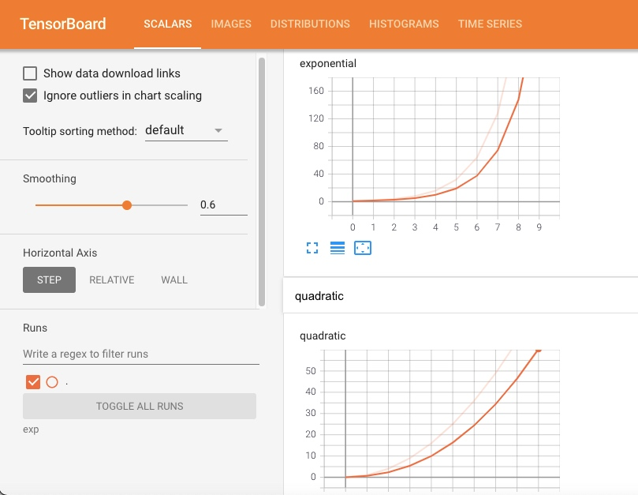

# PyTorch 中 Tensorboard 使用

1. 导入对应的库

    ```python
    from torch.utils.tensorboard import SummaryWriter
    ```

2. 新建 `SummaryWriter`

    ```python
    writer = SummaryWriter('runs/exp')
    # 参数
    log_dir：日志目录也就是上面指定的 'runs/exp' 可以使用默认的
    comment：可以理解成后缀名称
    ```

3. `add_scalar` 标量类型数据

    > 下面每一种展示方式，第一个参数都是标识符，用于数据分类。同一标识符的数据会展示在同一张表或者图上面，用 title 的方式展示出来。

    ```python
    from torch.utils.tensorboard import SummaryWriter
    writer = SummaryWriter('runs/exp')
    for i in range(10):
        # 画二次方程
        
        writer.add_scalar('quadratic', i**2, global_step=i)
        # 画指数方程
        writer.add_scalar('exponential', 2**i, global_step=i)
    # 关闭 SummaryWriter
    writer.close()
    参数：第二个参数可以理解为 x 轴，global_step 可以理解为 y 轴
    ```

    > 通过终端启动 tensorboard

    ```shell
    tensorboard --logdir=日志文件目录 --port=端口（可以使用默认端口）
    ```


