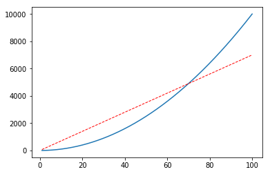
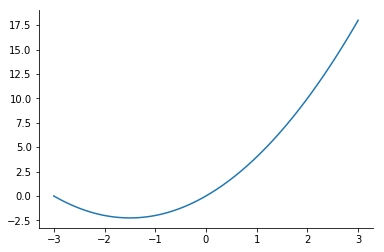

# matplotlib的基础知识

1. 本实例`matplotlib` 的数据都会使用 `numpy`产生，所以必须导入 `import numpy as np` (如果对`numpy`不了解,移步[numpy的基本使用](/2020/03/30/numpy-de-ji-chu-zhi-shi/))
2. 导入`matplotlib.pyplot` `import matplotlib.pyplot as plt`
3. `matplotlib` 基本绘图 （不会涉及到很复杂的用法）
    + 导入

        ```python
        import matplotlib.pyplot as plt
        import numpy as np
        ```

    + 线  

        ```python
        x = np.linspace(1, 100, 1000)
        # y = 2 * x + 1 # 直线
        # y = 2 ** x + 1 # 曲线
        plt.plot(x, y)
        plt.show() # 显示线
        ```  

    

    

    + 显示多条线

        ```python
        x = np.linspace(1, 100, 1000)
        y1 = 70*x + 1
        y2 = x**2 + 1
        plt.plot(x, y2)
        plt.plot(x, y1,
            color='red',   # 线颜色
            linewidth=1.0,  # 线宽
            linestyle='--'  # 线样式
        )
        plt.show()
        ```  

    

    + 显示多个图像

        ```python
        x = np.linspace(1, 100, 1000)
        y = 50 * x + 1
        y1 = x ** 2 + 1
        plt.plot(x, y)
        plt.figure(num=2, figsize=(8, 5)) # 此函数被调用一次就会重新申请一个figure对象就会多一个图 num 是图的编号，figsize 是图的大小
        plt.plot(x, y)
        plt.plot(x, y1)
        plt.show()
        ```

    + 设置范围

        ```python
        x = np.linspace(-3, 3, 100)
        y = 3*x + x**2
        plt.plot(x, y)
        plt.xlim(-2, 2) # 设置 x 轴范围
        plt.ylim(-2, 10) # 设置 y 轴范围
        plt.show()
        ```  

    

    + 替换坐标

        ```python
        x = np.linspace(-3, 3, 100)
        y = 3*x + x**2
        plt.plot(x, y)
        plt.xlim(-2, 2)
        plt.ylim(-2, 10)
        original = np.linspace(-2, 10, 7, dtype=np.int)
        plt.yticks(original, ['a', 'b', 'c', 'd', 'e', 'f', 'g']) # 用于替换坐标 第一个参数=被替换前的坐标 第二个参数=替换后的坐标
        plt.show()
        ```

    

    + 设置边框属性

        ```python
        x = np.linspace(-3, 3, 100)
        y = 3*x + x**2
        plt.plot(x, y)
        ax = plt.gca()
        ax.spines['right'].set_color('none') # 取消右边框
        ax.spines['top'].set_color('none') # 取消上边框
        plt.show()
        ```  

    

    + 设置坐标轴位置

        ```python
        x = np.linspace(-3, 3, 100)
        y = 3*x + x**2
        plt.plot(x, y)
        ax = plt.gca()
        ax.spines['right'].set_color('none')
        ax.spines['top'].set_color('none')
        ax.spines['bottom'].set_position(('data', 0)) # 使用.spines设置边框x轴；使用.set_position设置边框位置，y=0位置 位置所有属性有outward、axes、data
        ax.spines['left'].set_position(('data',0)) # 坐标中心点在(0,0)位置
        plt.show()
        ```  

    

    + 添加图列

        ```python
        x = np.linspace(1, 100, 1000)
        y = 50 * x + 1
        y1 = x ** 2 + 1
        plt.plot(x, y, label="y")
        plt.plot(x, y1, linestyle="--", label="y1")
        plt.legend(loc="best")
        plt.show()
        # 下面是 loc 的可选字段
        """
        'best' : 0,          
        'upper right'  : 1,
        'upper left'   : 2,
        'lower left'   : 3,
        'lower right'  : 4,
        'right'        : 5,
        'center left'  : 6,
        'center right' : 7,
        'lower center' : 8,
        'upper center' : 9,
        'center'       : 10,
        """
        ```  

   

4. 绘图种类
    + scatter散点图

        ```python
        x = np.floor(10 * np.random.random(100))
        y = np.floor(10 * np.random.random(100))
        plt.scatter(x, y, alpha=.5) # 透明度为 .5
        plt.show()
        ```  

    

    + 条形图

        ```python
        y = np.floor(10 * np.random.random(30))
        x = np.arange(1, 31)
        plt.bar(x, y)
        plt.show()
        ```  

    

    + 饼图

        ```python
        plt.figure(figsize=(8, 8))
        x = np.floor(10 * np.random.random(5))
        explode = np.zeros(5)
        explode[3] = .1
        plt.pie(x, autopct='%1.2f%%', explode=explode, labels=['a', 'b', 'c', 'd', 'e'])
        # autopct 格式化百分比精确输出 explode 是否突出显示 labels 标签
        plt.legend(loc='upper right')
        plt.show()
        ```  

    

    + 箱型图

        ```python
        fig = plt.figure(figsize=(8, 8))
        ax1 = fig.add_subplot(2, 1, 1) # 图切割成(2, 1) 选择第一块
        ax2 = fig.add_subplot(2, 1, 2) # 图切割成(2, 1) 选择第二块
        ax1.boxplot(range(5)) # 正向箱型图
        ax2.boxplot(range(5), vert=False) # 侧向箱型图
        plt.show()
        ```  

    
