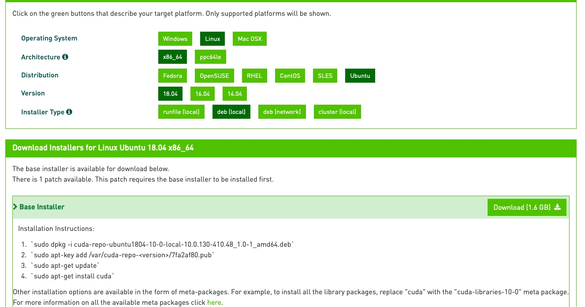

# Ubuntu 安装 CUDA

1. 这里安装的是 [CUDA 10.0](https://developer.nvidia.com/cuda-10.0-download-archive?target_os=Linux&target_arch=x86_64&target_distro=Ubuntu&target_version=1804&target_type=deblocal)

    

2. 下载 `CUDA`

    ```shell
    wget https://developer.download.nvidia.com/compute/cuda/repos/ubuntu1804/x86_64/cuda-ubuntu1804.pin
    sudo mv cuda-ubuntu1804.pin /etc/apt/preferences.d/cuda-repository-pin-600
    wget https://developer.download.nvidia.com/compute/cuda/11.1.0/local_installers/cuda-repo-ubuntu1804-11-1-local_11.1.0-455.23.05-1_amd64.deb
    ```

3. 执行下面语句用于安装

    ```shell
    sudo dpkg -i cuda-repo-ubuntu1804-10-0-local-10.0.130-410.48_1.0-1_amd64
    sudo apt-key add /var/cuda-repo-10-0-local-10.0.130-410.48/7fa2af80.pub
    sudo apt-get update
    sudo apt-get install cuda
    ```

4. 重启系统 `sudo reboot`
