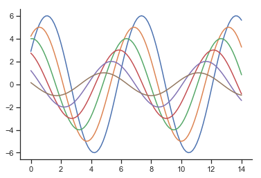

# seaborn的基础知识

1. `seaborn` 是在 `matplotlib` 基础上进行封装的，所以学习`seaborn`前还是得有点 `matplotlib` 的基础知识，前往 `matplotlib`学习吧

2. 需要导入的模块没有学习到的模块可以在我的博客中寻找学习方法

    ```python
    import numpy as np
    import seaborn as sns
    import matplotlib as mpl
    import matplotlib.pyplot as plt
    ```

3. 风格管理

    ```python
    定义一个正弦波帮助我们查看不同的画图风格
    def sinplot(flip=1):
    x = np.linspace(0, 14, 100)
    for i in range(1, 7):
        plt.plot(x, np.sin(x + i * .5) * (7 - i) * flip)
    sinplot()
    ```

    

    + 绘图风格设置
        + 默认风格 (darkgrid)

            ```python
            sns.set() # 和 sns.set_style('darkgrid') 一样
            sinplot()
            ```  

        

        + whitegrid

            ```python
            sns.set_style('whitegrid')
            sinplot()
            ```  

        

        + dark

            ```python
            sns.set_style('dark')
            sinplot()
            ```

        

        + white

            ```python
            sns.set_style('white')
            sinplot()
            ```

        

        + ticks

            ```python
            sns.set_style('ticks')
            sinplot()
            ```

        

        + 移除轴脊柱

            ```python
            sinplot()
            sns.despine()
            ```

        

        + 轴脊柱偏置

            ```python
            sinplot()
            sns.despine(offset=20, trim=True) # 轴脊柱偏置 20 trim用于限制范围
            ```

        

        + 脊柱移除

            ```python
            sinplot()
            sns.despine(left=True)
            ```

        

        + 临时风格

            ```python
            with sns.axes_style('darkgrid'):
            plt.subplot(211)
            sinplot()
            plt.subplot(212)
            sinplot()
            ```

        

        + 绘图元素比例

            + paper

                ```python
                sns.set_context("paper")
                sinplot()
                ```  

            

            + notebook

                ```python
                sns.set_context("notebook")
                sinplot()
                ```

            

            + talk

                ```python
                sns.set_context("talk")
                sinplot()
                ```

            

            + poster

                ```python
                sns.set_context("poster")
                sinplot()
                ```

            

    + 颜色风格设置
  
4. 绘图方法
    + 数据集的分布可视化
    + 分类数据可视化
    + 线性关系可视化

5. 结构网络
    + 数据识别网络绘图
