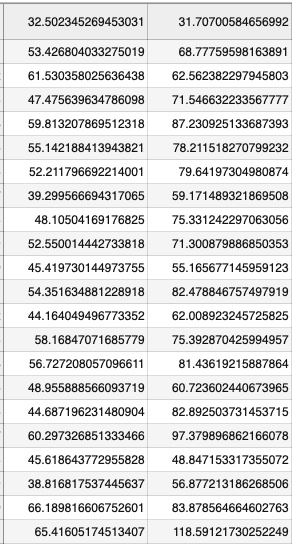
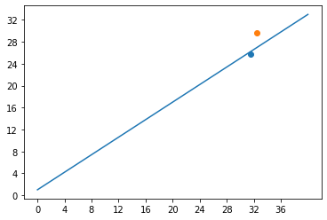
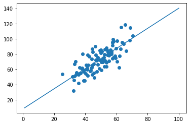
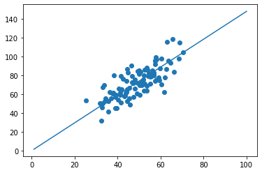

# 线性回归

1. 这个项目用了下面的库

    ```python
    numpy
    matplotlib
    ```

2. 这个项目的数据格式[点击链接下载数据](https://raw.githubusercontent.com/ncdhz/deep-learning-study-code/master/linear-regression/data.csv)

    ```
    这个项目的数据有两项，我们可以理解成x坐标和y坐标 
    如下图
    x: 32.502345269453031
    y: 31.70700584656992
    ```

    

    

3. 引入项目所需要的库

    ```python
    # 用于处理数据
    import numpy as np
    # 用于画图
    import matplotlib.pyplot as plt
    ```

4. 损失函数
    $$loss=\sum_{i=1}^{n}{(w*x_i+b-y_i)^2}$$

    + 为什么这样定义损失函数

    观察下面的图，我们画了一条直线准备穿过这两个点。显然这条直线没有达到预期，其中存在一定的误差。那该怎么表示这个误差呢，我们可以取一个  x 然后计算出 y 值，对比真实的 y 值也就是 $$w*x_i+b-y_i$$ 这样我们就可以得到计算出来的 y 值和真实值之间的误差。但是这样会出现一个问题----误差会出现正负两种情况。所以就加上了绝对值 $$(w*x_i+b-y_i)^2$$ 然后再把每个点的误差相加就形成了损失函数 $$\sum_{i=1}^{n}{(w*x_i+b-y_i)^2}$$

    

    + 根据上面的损失函数编写代码

    ```python
    def compute_error_for_line_given_points(b, w, points):
        # 用于保存累加和
        totalError = 0
        # 这个for循环就相当于上面的累加符号
        for i in range(0, len(points)):
            # 取出二维数组中的第i个数组的第一个数据
            x = points[i, 0]
            # 取出二维数组中的第i个数组的第二个数据
            y = points[i, 1]
            # ((w * x + b) - y) ** 2 就是上面公式单个损失值
            totalError += ((w * x + b) - y) ** 2
        # 返回损失函数一般会除元素数量
        return totalError / float(len(points))
    ```

5. 求解最小化`w` 和 `b`
    + 目标优化式

    $$(w^*, b^*) = argmin\sum_{i=1}^{n}{(w*x_i+b-y_i)^2}$$

    + 求解的两种方法
        + 最小二乘法
        我们先将损失函数loss对w求导和对w求导
            $$
            \begin{split}
            \frac{\partial{loss}}{\partial{w}}&={2\sum_{i=1}^{n}{(w*x_i+b-y_i)*x_i}} \\
            &=2({w\sum_{i=1}^{n}{x_i^2}-\sum_{i=1}^{n}{(y_i-b)*x_i}})
            \end{split}
            $$
            $$
            \begin{split}
            \frac{\partial{loss}}{\partial{b}}&={\sum_{i=1}^{n}2(w*x_i+b-y_i)} \\
            &= 2(n*b-\sum_{i=1}^{n}{(y_i-w*x_i)})
            \end{split}
            $$
            让上两式为0可以得到 w 和 b 最优解的闭式(closed-form)解

            $$
            \begin{eqnarray*}
            w &=& \frac{\sum_{i=1}^{n}{y_i(x_i-\overline{x})}}{\sum_{i=1}^{n}{x_i^2}-{\frac{1}{n}{(\sum_{i=1}^{n}{x_i})^2}}} \\
            \overline{x} &=&{\frac{1}{n}{\sum_{i=1}^{n}{x_i}}} \\
            b &=& \frac{1}{n}\sum_{i=1}^{n}{(y_i-w*x_i)}
            \end{eqnarray*}
            $$

        + 最小二乘法代码

        ```python
        # points 数据
        def least_square_method(points):
            # x 的平均值
            x_average = 0
            # 数据的长度
            points_len = len(points)
            # 数据的长度浮点型
            N = float(points_len)
            # 累加 x 
            for i in range(0, points_len):
                # points[i, 0] 数据 x
                x_average += points[i, 0]
            # w 式子中的3个子式 w_1 分母中左边那个 w_2 分母中右边那个 w_3 分子
            w_1 = w_2 = w_3 = 0
            # x_average 中存放的是 x 累加的和还没有平均
            # x 的平方除以数据长度
            w_2 = x_average ** 2 / N
            # 求出平均数
            x_average /= N
            # 求 w_1 和 w_3
            for i in range(0, points_len):
                w_1 += points[i, 0] ** 2
                w_3 += points[i, 1] * (points[i, 0] - x_average)
            # 计算 w
            w = w_3 / (w_1 - w_2)
            # 计算 b
            b = 0
            for i in range(0, points_len):
                b += (points[i, 1] - w * points[i, 0])
            b /= N
            return [b, w]
        ```

        + 通过最小二乘法求出来的结果

        ```python
        def run_least_square_method():
            # 获取文件中的数据
            points = np.genfromtxt('data.csv', delimiter=',')
            # 求出直线的 w 和 b 值
            b, w = least_square_method(points)
            # 画图 x 点随机生成
            x = np.linspace(1, 100, 100)
            # 根据 x w b 求出 y
            y = x * w + b
            # 画数据点
            plt.scatter(points[:, 0], points[:, 1])
            # 划线
            plt.plot(x, y)
            plt.show()
            # 通过最小二乘法求出来的误差
            error = compute_error_for_line_given_points(b, w, points)
            print('error = {0}'.format(error))
        ```

        

    + 梯度下降法
        这个项目的损失函数

        
        
        梯度下降的原理：损失函数可以说是错误率，这个值越小越好，显然只有到达这个图最低点时错误率就是最小的。假设这个曲面中间有一点，那么他用什么办法可以到达最低点呢（也就是他应该往哪个方向移动他才能到达最低点）。经过研究当沿着当前点所在位置的切线方向走是最快的，且可以到达最低点。所以就有了下面的公式。（其中`lr`为学习率，也就是防止走的过快超过了最低点）

        $$
        \begin{eqnarray*}
        w^{'}&=&w-lr*\frac{\partial{loss}}{\partial{w}} \\
        \frac{\partial{loss}}{\partial{w}}&=&2*\sum_{i=1}^{n}{(w*x_i+b-y_i)*x_i} \\
        b^{'}&=&b-lr*\frac{\partial{loss}}{\partial{b}} \\
        \frac{\partial{loss}}{\partial{b}}&=&2*\sum_{i=1}^{n}{(w*x_i+b-y_i)}
        \end{eqnarray*}
        $$

        + 梯度下降代码

        ```python
        # b_current 当前的 b 值
        # w_current 当前的 w 值
        # points 数据 
        # learningRate 学习率
        def step_gradient(b_current, w_current, points, learningRate):
            # b 的梯度，也就是 b 导数值
            b_gradient = 0
            # w 的梯度，也就是 w 导数值
            w_gradient = 0
            # 数据长度
            N = float(len(points))
            # 上面公式中累加的过程
            for i in range(0, len(points)):
                # 取出 x 值
                x = points[i, 0]
                # 取出 y 值
                y = points[i, 1]
                # 由求导之后的公式变成的式子
                b_gradient += (2/N) * ((w_current * x + b_current) - y)
                w_gradient += (2/N) * x * ((w_current * x + b_current) - y)
            # 式子整合求出经过梯度下降的 b
            new_b = b_current - (learningRate * b_gradient)
            new_w = w_current - (learningRate * w_gradient)
            return [new_b, new_w]
        ```

        + 通过梯度下降求出来的结果

        ```python
        # 控制梯度下降算法迭代次数
        # points 数据
        # starting_b 初始化b
        # starting_w 初始化w
        # learning_rate 学习率
        # num_iterations 迭代次数
        def gradient_descent_runner(points, starting_b, starting_w, learning_rate, num_iterations):
            b = starting_b
            w = starting_w
            # 迭代
            for i in range(num_iterations):
                # 没迭代一次就调用一次梯度下降算法
                b, w = step_gradient(b, w, np.array(points), learning_rate)
            return [b, w]
        ```

        ```python
        # 运行梯度下降算法
        def step_gradient_run():
            # 获取数据
            points = np.genfromtxt("data.csv", delimiter=",")
            # 初始化学习率
            learning_rate = 0.0001
            # 初始化 b 和 w
            initial_b = 0
            initial_w = 0
            # 初始化迭代次数
            num_iterations = 1000
            print("b = {0}, w = {1}, error = {2}"
                  .format(initial_b, initial_w, compute_error_for_line_given_points(initial_b, initial_w, points)))
            [b, w] = gradient_descent_runner(points, initial_b, initial_w, learning_rate, num_iterations)
            # 画图 x 点随机生成
            x = np.linspace(1, 100, 100)
            # 根据 x w b 求出 y
            y = x * w + b
            # 画数据点
            plt.scatter(points[:, 0], points[:, 1])
            # 划线
            plt.plot(x, y)
            plt.show()
            print("b = {0}, w = {1}, error = {2}"
                  .format(b, w, compute_error_for_line_given_points(b, w, points)))
        ```

        

6. [项目地址](https://github.com/ncdhz/deep-learning-study-code/tree/master/linear-regression)
