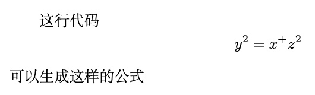
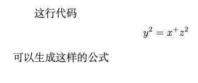

# LaTeX公式、编号、对齐

## 行内公式

1. 用 `$...$` 符号

    ```latex
    这行代码 $y^2=x^+z^2$ 可以生成这样的公式
    ```

    这行代码 $y^2=x^+z^2$ 可以生成这样的公式

2. 用小括号

    ```latex
    这行代码 \(a = b + c\) 可以生成这样的公式
    ```

    

3. 用`math`环境

    ```latex
    这行代码 \begin{math}
        a=b+c
    \end{math} 可以生成这样的公式 
    ```

    

## 块级公式

1. 用 `$$...$$` 符号

    ```latex
    这行代码 $$y^2=x^+z^2$$ 可以生成这样的公式
    ```

    这行代码 $$y^2=x^+z^2$$ 可以生成这样的公式
2. 用 `\[\]` 符号

    ```latex
    这行代码 \[y^2=x^+z^2\] 可以生成这样的公式
    ```

    

3. 用`displaymath`环境

    ```latex
    这行代码 
        \begin{displaymath}
            y^2=x^+z^2
        \end{displaymath}
    可以生成这样的公式
    ```

    

4. 公式的编号
    + 手动编号

        通过 `\tag{...}` 可以生成对应的编号

        ```latex
        这行代码 $$y^2=x^+z^2 \tag{1.1}$$ 可以生成这样的公式
        ```

        这行代码 $$y^2=x^+z^2 \tag{1.1}$$ 可以生成这样的公式

    + 自动编号（CMDMarkdown并不支持自动编号）

        使用 `\begin{equation}...\end{equation}` 包裹代码可以自动编号

        ```latex
        自动编号测试
        $$
        \begin{equation}
        y^2=x^+z^2
        \end{equation}
        $$
        ```

        自动编号测试
        $$
        \begin{equation}
        y^2=x^+z^2
        \end{equation}
        $$

    + 编号的引用
        通过`$(编号)$`就可以引用了

        ```latex
        测试引用 $$y^2=x^+z^2 \tag{1.1}$$
        引用 $(1.1)$
        ```

        测试引用 $$y^2=x^+z^2 \tag{1.1}$$
        引用 $(1.1)$

5. 换行和整体编号
    + 单个公式很长的时候需要换行，但仅允许生成一个编号时，可以用`split`标签包围公式代码，在需要转行的地方使用`\\`，每行需要使用1个&来标识对齐的位置，结束后可使用`\tag{...}`标签编号

        ```latex
        $$
        \begin{split}
        a &= b \\
        c &= d 
        \end{split}\tag{1.3}
        $$
        (其中 & 公式对齐)
        (注意：每行只允许出现一个&，使用split标签后，编号会上下居中显示)
        ```

        $$
        \begin{split}
        a &= b \\
        c &= d
        \end{split}\tag{1.1}
        $$

6. 多行的独立公式
    + 有时候需要罗列多个公式，可以用`eqnarray*`标签包围公式代码，在需要转行的地方使用`\\`，每行需要使用2个`&`来标识对齐位置，两个`&...&`号之间的是公式间对齐的位置，每行公式后可使用`\tag{...}`标签编号

        ```latex
        $$
        \begin{eqnarray*}
        x^n+y^n &=& z^n \tag{1.1} \\
        x+y &=& z \tag{1.2}
        \end{eqnarray*}
        $$
        ```

        $$
        \begin{eqnarray*}
        x^n+y^n &=& z^n \tag{1.1} \\
        x+y &=& z \tag{1.2}
        \end{eqnarray*}
        $$
