# LaTeX 基础知识

1. 导入文档类型

    ```latex
    % 导入文档的命令
    \documentclass{文档类型}
    % 可以根据自己的需求导入合适的文档
    \documentclass{article} % 论文
    \documentclass{book} % 书籍
    \documentclass{report} % 报告
    \documentclass{letter} % 信
    %注意：一个 tex 文件只能有一个文档类型
    ```

2. 支持中文包

    ```latex
    % 首先文档格式应该调整为 uft8
    % 构建命令应为 xelatex
    % 添加下面的命令
    \usepackage{ctex}
    ```

    + 打开 `ctex` 的文档

        ```latex
        // 在命令行中输入以下命令
        texdoc ctex 
        ```

3. 文档简介命令

    ```latex
    \title{标题}
    \author{作者}
    \date{\today} % 时间 其中 \today 表示是今天
    ```

4. 正文区

    ```latex
    % 有且只能有一个正文区
    \begin{document}
        % 下面命令表示文档中添加上面简介信息 （不是每一个文档类都支持此命令）
        \maketitle
    \end{document}
    ```

5. 字体设置

    + `LaTex` 中字体属性
        + 字体编码
            + 正文字体编码

                ```latex
                OT1
                T1
                EU1
                ```

            + 数学字体编码

                ```latex
                OML
                OMS
                OMX
                ```

        + 字体族
            + 罗马字体

                ```latex
                % 设置{}里面字体为罗马字体
                \textrm{内容}
                % 声明后续字体为罗马字体
                \rmfamily 内容
                % 注意可以用 {} 包裹表示只影响这个范围内的字体
                {\rmfamily 内容}
                ```

            + 无衬线字体

                ```latex
                % 道理同上
                \textsf{内容}
                {\sffamily 内容}
                ```

            + 打字机字体

                ```latex
                % 道理同上
                \texttt{内容}
                {\ttfamily 内容}
                ```

        + 字体系列
            + 粗细、宽度

                ```latex
                \textmd{内容}
                \textbf{内容}
                {\mdseries 内容}
                {\bfseries 内容}
                ```

        + 字体形状
            + 直立

                ```latex
                \textup{内容}
                {\upshape 内容}
                ```

            + 斜体

                ```latex
                \textit{内容}
                {\itshape 内容}
                ```

            + 伪斜体

                ```latex
                \textsl{内容}
                {\slshape 内容}
                ```

            + 小型大写

                ```latex
                \textsc{内容}
                {\scshape 内容}
                ```

            + 中文字体

                ```latex
                % 注意：需要使用 ctex 宏包
                {\songti 宋体} 
                {\heiti 黑体}
                {\fangsong 仿宋}
                {\kaishu 楷书}
                ```

        + 字体大小

            ```latex
            % 字体大小是相较于`documentclass`中默认字体大小来定义的（可以通过下面的方式更改默认字体大小）
            % 设置默认字体为10磅
            \documentclass[10pt]{}
            % 设置默认字体为11磅
            \documentclass[11pt]{}
            % 设置默认字体为12磅
            \documentclass[12pt]{}
            % 注意没有 13pt 14pt 等
            % 对应下面字体
            {\tiny Hello} \\
            {\scriptsize Hello} \\
            {\footnotesize Hello} \\
            {\small Hello} \\
            {\normalsize Hello} \\
            {\large Hello} \\ 
            {\Large Hello} \\
            {\huge Hello} \\ 
            {\Huge Hello} \\
            ```

            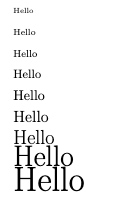

            ```latex
            % ctex 中还定义了一个字号大小命令
            \zihao{0} 你好！ \\
            \zihao{1} 你好！ \\ 
            \zihao{5} 你好！ \\
            ```

            

6. 构建提纲

    ```latex
    \begin{document}
        % 小节
        \section{引言}
        \section{实验方法}
        \section{实验结果}
        % 子小节
        \subsection{数据}
        \subsection{图表}
        % 子子小节
        \subsubsection{实验条件}
        \subsubsection{实验过程}
        \section{结论}
        \section{致谢}
    \end{document}
    ```

    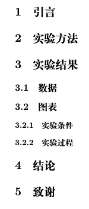

    + 产生目录

        ```latex
        % 产生目录
        \tableofcontents
        % 大纲
        \section{引言}
        \section{实验方法}
        \section{实验结果}
        \subsection{数据}
        \subsection{图表}
        \subsubsection{实验条件}
        \subsubsection{实验过程}
        \section{结论}
        \section{致谢}
        ```

        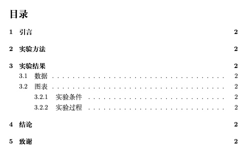

7. 特殊字符处理

    + 空白字符

        ```latex
        % 空行分段，多空格等于一个空格
        % 自动缩进，决不能使用空格代替
        % 英文中多个空格处理为一个空格，中文会被忽略
        % 汉字与其它字符的间距会制动由XeLaTeX处理
        % 禁止使用中文全角空格
        ```

        ```latex
        % 1em (当前字体中m的宽度)    
        a\quad b
    
        % 2em 
        a\qquad b
        
        % 约1/6个em
        a\,b a\thinspace b
    
        % 0.5个em
        a\enspace b
    
        % 空格
        a\ b
    
        % 硬空格
        a~b
    
        % 1pc=12pt=4.218mm
        a\kern 1pc b
    
        a\kern -1em b
    
        a\hskip 1em b
    
        a\hspace{35pt} b
    
        % 占位宽度
        a\hphantom{xyz} b
    
        % 弹性长度
        a\hfill b
        ```

        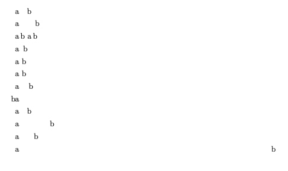

    + 控制符

        ```latex
        % 下面字符在latex 中有特殊定义所以需要转译
            \# \$ \% \{ \} \~{} \_{} \^{} \textbackslash \&
        ```

        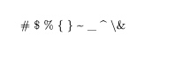

    + 排版符号

        ```latex
        \S \P \dag \ddag \copyright \pounds
        ```

        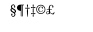

    + 标志符号

        ```latex
        \Tex{} \LaTeX{} \LaTeXe{}
        ```

        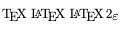

        ```latex
        \documentclass[10pt]{article}
        \usepackage{ctex}
        \usepackage{xltxtra}
        \usepackage{texnames}
        \usepackage{mflogo}
        
        \begin{document}
            % xltxtra 宏包提供
            \XeLaTeX
        
            % texnames 宏包提供
            \AmSTeX{} \AmS-\LaTeX{}
            \BibTeX{} \LuaTeX
            
            % mflogo 宏包提供
            \METAFONT{} \MF{} \MP{}
        \end{document}
        ```

        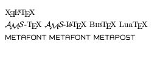

    + 引号

        ```latex
        % 和常规的单双引号不同 （撇号 和 单引号）
        `您好' 
        ``您好''
        ```

        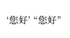

    + 连字符

        ```latex
        % - -- ---
        ```

        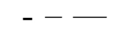

    + 非英文字符

        ```latex
        \oe \OE \ae \AE \AA \o \O \l \L \ss \SS !`?'
        ```

        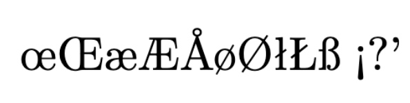

    + 重音符号

        ```latex
        \`o \'o \^o \~o \=o \u{o} \v{o} \H{o} \r{o} \t{o} \b{o} \c{o} \d{o}
        ```

        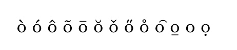

8. 插图
    + 导入插入宏包 `\usepackage{graphicx}`
    + 使用语法

        ```latex
        \includegraphics[<选项>]{文件名}
        ```

    + 支持格式：`EPS,PDF,PNG,JPNG,BMP`
    + 指定搜索路径

        ```latex
        \graphicspath{{image/}} % 表示当前文件夹中 image 文件夹下 
        ```

    + 参数讲解

        ```latex
         % 缩放比
        \includegraphics[scale=0.3]{}
        
        % 指定高度
        \includegraphics[height=15cm]{}
        
        % 指定宽度
        \includegraphics[width=2cm]{}
    
        % 版型文本高度的0.1
        \includegraphics[height=0.1\textheight]{}
    
        % 版型文本宽度的0.1
        \includegraphics[width=0.1\textwidth]{}
        
        % 旋转角度
        \includegraphics[angle=45]{}
    
        % 多参数
        \includegraphics[angle=45, width=2cm]{}

        ```

        + `graphicx` 帮助文档 `texdoc graphicx`
9. 表格
    + 基本表格

        ```latex
        % l 表示居左 c 表示居中 r 表示居右 （l c c c r (表示有五列分别是 居左 居中 居中 居中 居右)）
        \begin{tabular}{l c c c r}
            姓名 & 语文 & 数学 & 外语 & 备注 \\
            李四 & 87 & 100 & 93 & 优秀 \\
            张三 & 87 & 100 & 33 & 补考 \\
            网二 & 66 & 70 & 63 & 一般 \\
        \end{tabular}
        ```

        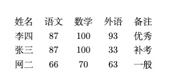

    + 带竖线的表格

        ```latex
        % 用 | 分割就可以得到带竖线的表格
        \begin{tabular}{|l|c|c|c|r|}
            姓名 & 语文 & 数学 & 外语 & 备注 \\
            李四 & 87 & 100 & 93 & 优秀 \\
            张三 & 87 & 100 & 33 & 补考 \\
            网二 & 66 & 70 & 63 & 一般 \\
        \end{tabular}
        ```

        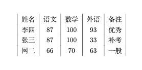

        ```latex
        % 多条竖线表示多竖线表格
        \begin{tabular}{||l|c|c|c|r||}
            姓名 & 语文 & 数学 & 外语 & 备注 \\
            李四 & 87 & 100 & 93 & 优秀 \\
            张三 & 87 & 100 & 33 & 补考 \\
            网二 & 66 & 70 & 63 & 一般 \\
        \end{tabular}
        ```

        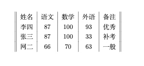

    + 横线表格

        ```latex
        % 通过 \hline 来添加横线
        \begin{tabular}{||l|c|c|c|r||}
            \hline
            姓名 & 语文 & 数学 & 外语 & 备注 \\
            \hline
            \hline
            李四 & 87 & 100 & 93 & 优秀 \\
            \hline
            张三 & 87 & 100 & 33 & 补考 \\
            \hline
            网二 & 66 & 70 & 63 & 一般 \\
            \hline
        \end{tabular}
        ```

        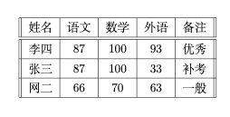

    + 指定宽度表格

        ```latex
        % 通过p{宽度}来指定表格宽度 超过宽度就会换行
        \begin{tabular}{||l|c|c|c|p{1.5cm}||}
            \hline
            姓名 & 语文 & 数学 & 外语 & 备注 \\
            \hline
            \hline
            李四 & 87 & 100 & 93 & 超级超级优秀 \\
            \hline
            张三 & 87 & 100 & 33 & 补考 \\
            \hline
            网二 & 66 & 70 & 63 & 一般 \\
            \hline
        \end{tabular}
        ```

        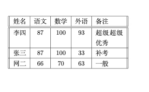

    + 一些特殊的表格格式可以使用对应的宏包来处理

        ```latex
        % 其宏包文档命令
        % 三线表
        texdoc booktab
        % 跨越长表格
        texdoc longtab
        % 综合表格宏包
        texdoc tabu
        ```

10. 浮动体
    浮动就是脱离文档流，可以理解成漂浮在文档之上
    + `figure` 浮动体 （同下）

        ```latex
        \begin{figure}
        \end{figure}
        ```

    + `table` 浮动体

        ```latex
        \begin{table}
        \end{table}
        ```

        + 居中

            ```latex
            \begin{table}
                \centering
                \begin{tabular}{|l|c|c|c|r|}
                    \hline
                    姓名 & 语文 & 数学 & 外语 & 备注 \\
                    \hline
                    \hline
                    张三 & 87 & 100 & 33 & 补考 \\
                    \hline
                    网二 & 66 & 70 & 63 & 一般 \\
                    \hline
                \end{tabular}
            \end{table}
            ```

        + 编号

            ```latex
            \begin{table}
                \centering
                \begin{tabular}{|l|c|c|c|r|}
                    \hline
                    姓名 & 语文 & 数学 & 外语 & 备注 \\
                    \hline
                    \hline
                    张三 & 87 & 100 & 33 & 补考 \\
                    \hline
                    网二 & 66 & 70 & 63 & 一般 \\
                    \hline
                \end{tabular}
                \caption{表格}
            \end{table}
            ```

            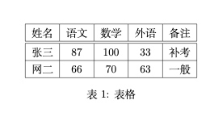
        + 标签

            ```latex
            引用表 \ref{table-1}

            \begin{table}
                \centering
                \begin{tabular}{|l|c|c|c|r|}
                    \hline
                    姓名 & 语文 & 数学 & 外语 & 备注 \\
                    \hline
                    \hline
                    张三 & 87 & 100 & 33 & 补考 \\
                    \hline
                    网二 & 66 & 70 & 63 & 一般 \\
                    \hline
                \end{tabular}
                \caption{表格} \label{table-1}
            \end{table}
            ```

            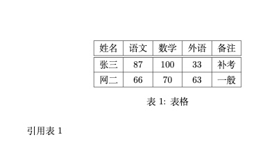
        + 位置

            ```latex
            % <允许位置>参数默认（tbp）
            % h 此处 （here）代码所在文字
            % t 页顶 （top）代码所在页面或之后页面的顶部
            % b 页低 （bottom） 代码所在页面或之后页面的底部
            % p 独立一页 （page）浮动页面
            ```

            ```latex
            % 引用表命令 \ref{lable名}
            引用表 \ref{table-1}
            % htbp 代表所有位置都可以
            \begin{table}[htbp]
                \centering
                \begin{tabular}{|l|c|c|c|r|}
                    \hline
                    姓名 & 语文 & 数学 & 外语 & 备注 \\
                    \hline
                    \hline
                    张三 & 87 & 100 & 33 & 补考 \\
                    \hline
                    网二 & 66 & 70 & 63 & 一般 \\
                    \hline
                \end{tabular}
                \caption{表格} \label{table-1}
            \end{table}
            ```

            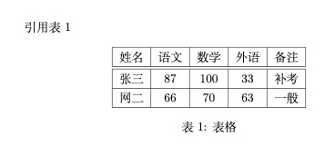

11. 数学公式
    + 上下标
        + 上标

            ```latex
            \begin{document}
                $3x^{20} + 5 = 0$
            \end{document}
            ```

            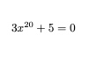

        + 下标

            ```latex
            \begin{document}
                $3x_{20} + 5 = 0$
            \end{document}
            ```

            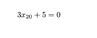
    + 希腊字母

        ```latex
        \begin{document}
            $\aleph$
            $\beta$
            $\gamma$
            $\epsilon$
            $\pi$
            $\omega$
            
            $\Gamma$
            $\Delta$
            $\Theta$
            $\Pi$
            $\Omega$
        \end{document}
        ```

        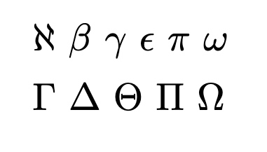

    + 数学函数

        ```latex
        \begin{document}
            $\log$
            $\sin$
            $\cos$
            $\arccos$
            $\arcsin$
            $\ln$
            
            $\sin^2x + \cos^2x = 1$
        \end{document}
        ```

        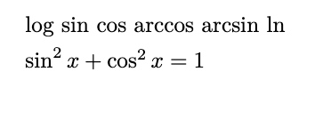

    + 分式

        ```latex
        $\frac{x}{x^2+x-1}$

        $\frac{\sqrt{x^2+2}}{10}$
        ```

        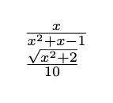

12. 矩阵
    + 引入宏包

        ```latex
        \usepackage{amsmath}
        ```

    + 不同矩阵
        + 不带任何线

            ```latex
            \[
                \begin{matrix}
                    0 & 1 \\
                    2 & 3
                \end{matrix}  
            \]
            ```

            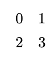

        + 带线的

            ```latex
            \dots : 横
            \vdots : 竖
            \ddots : 右斜
            ```

            ```latex
            \[
                % 小括号
                \begin{pmatrix}
                    0 & 1 \\
                    2 & 3
                \end{pmatrix} \qquad
                % 中括号
                \begin{bmatrix}
                    0 & 1 \\
                    2 & 3
                \end{bmatrix} \qquad
                % 大括号
                \begin{Bmatrix}
                    0 & 1 \\
                    2 & 3
                \end{Bmatrix} \qquad
                % 一条竖线
                \begin{vmatrix}
                    0 & 1 \\
                    2 & 3
                \end{vmatrix} \qquad
                % 两条竖线
                \begin{Vmatrix} 
                    0 & 1 \\
                    2 & 3
                \end{Vmatrix}  
            \]
            ```

            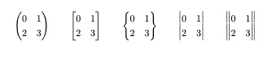

    + 省略号

        ```latex
        \[
            A = \begin{bmatrix}
                a_{11} & \dots & a_{1n} \\
                & \ddots & \vdots \\
                a_{n1} && \dots & a_{nn}
            \end{bmatrix}_{n \times n}
        \]
        ```

        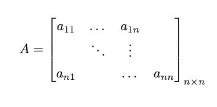

13. 自定义命令
    + 新定义命令

        ```latex
        % \newcommand-定义命令
        % 命令只能由字母组成不能以 \end 开头
        % \newcommand<命令>[<参数个数>][<首参数默认值>]{{具体定义}}
        ```

        ```latex
        \newcommand\PRC{People's Republic \emph{China}}
        \begin{document}
            \PRC
        \end{document}
        ```

        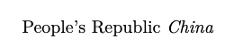

        ```latex
        \newcommand\loves[2]{#1 喜欢 #2！}
        \begin{document}
            \loves{猫儿}{鱼}
        \end{document}
        ```

        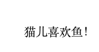

        ```latex
        \newcommand\loves[3][喜欢]{#2#1#3！}
        \begin{document}
            \loves{猫儿}{鱼}
            \loves[最爱]{猫儿}{鱼}
        \end{document}
        ```

        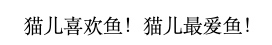

    + 重新定义命令

        ```latex
        % \renewcommand-重定义命令
        % 与 \newcommand 命令作用和用法相同，但是只能用于已有的命令
        % \renewcommand<命令>[<参数个数>][<首参数默认值>]{{具体定义}}
        ```

    + 定义和重定义环境

        ```latex
        \newenvironment{<环境名称>}[<参数个数>][<首参数默认值>]{<环境前定义>}{<环境后定义>}
        \renewenvironment{<环境名称>}[<参数个数>][<首参数默认值>]{<环境前定义>}{<环境后定义>}
        ```

        ```latex
        \newenvironment{myabstract}[1][摘要]{
            \small
            \begin{center}
                \bfseries #1
            \end{center}
            \begin{quotation}
        }{
            \end{quotation}
        }
        
        \begin{document}
            \begin{myabstract}
                这是一段自定义格式的摘要
            \end{myabstract}
        
            \begin{myabstract}[我的摘要]
                这是一段自定义格式的摘要
            \end{myabstract}
        \end{document}
        ```

        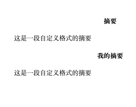

14. 一些常用命令

    ```latex
    \par % 产生新段落
    % 插入空行也可以产生新段落
    \\ % 换行不产生新段落
    \text{} 在公式在使用 可以显示中文
    ```
