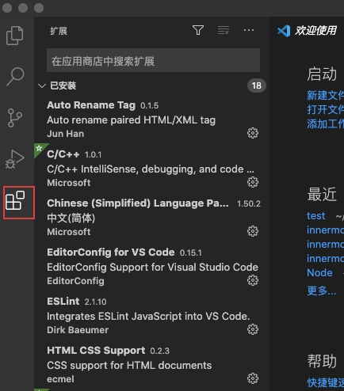
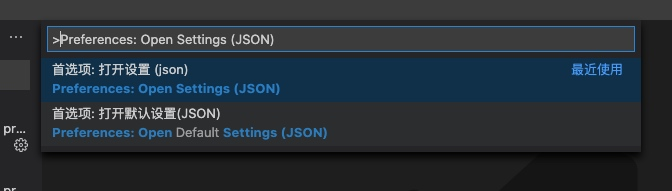
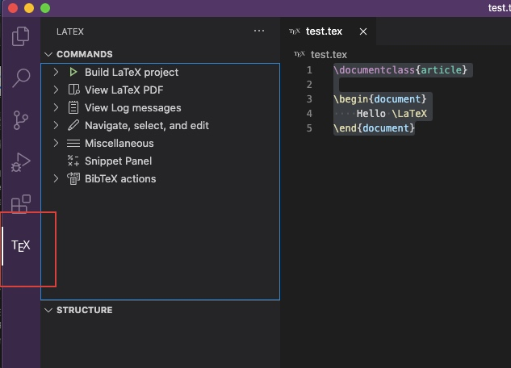
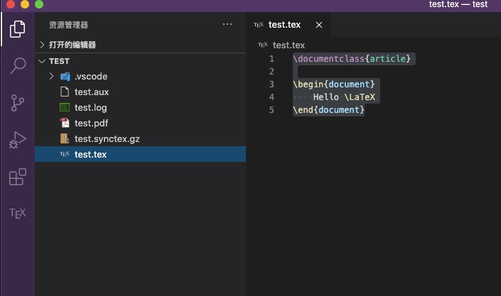
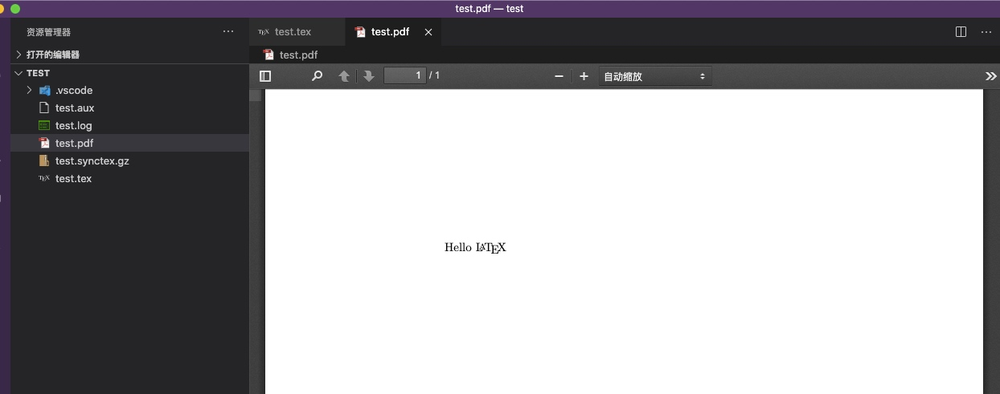

# VSCode 配置 LaTex

1. 打开 `VSCode` 插件商店

    

2. 搜索 `LaTex Workshop` 并安装

3. 打开 `VSCode` 设置
    + 点击 `Ctrl Shift P`
    + 搜索 `Preferences: Open Settings (JSON)`

    

4. 添加如下设置

    ```json
    // 将编译工具配置添加到用户设置中
    "latex-workshop.latex.tools": [
        {
            "name": "xelatex",
            "command": "xelatex",
            "args": [
                "-synctex=1",
                "-interaction=nonstopmode",
                "-file-line-error",
                "%DOCFILE%"
            ]
        },
        {
            "name": "pdflatex",
            "command": "pdflatex",
            "args": [
                "-synctex=1",
                "-interaction=nonstopmode",
                "-file-line-error",
                "%DOCFILE%"
            ]
        },
        {
            "name": "bibtex",
            "command": "bibtex",
            "args": [
                "%DOCFILE%"
            ]
        }
    ],
    // 将编译方案配置添加到用户设置
    "latex-workshop.latex.recipes": [
        {
            "name": "xelatex",
            "tools": [
                "xelatex"
            ],
        },
        {
            "name": "pdflatex",
            "tools": [
                "pdflatex"
            ]
        },
        {
            "name": "xe->bib->xe->xe",
            "tools": [
                "xelatex",
                "bibtex",
                "xelatex",
                "xelatex"
            ]
        },
        {
            "name": "pdf->bib->pdf->pdf",
            "tools": [
                "pdflatex",
                "bibtex",
                "pdflatex",
                "pdflatex"
            ]
        }
    ],
    // 使用内置pdf浏览器预览pdf文件
    "latex-workshop.view.pdf.viewer": "tab",
    // 自动编译
    "latex-workshop.latex.autoBuild.run": "onFileChange",
    // 不想在保存时自动编译
    // "latex-workshop.latex.autoBuild.run": "never",
    // 隐藏在编译出现错误或警告时自动弹出的提示窗口
    "latex-workshop.message.error.show": false,

"latex-workshop.message.warning.show": false
    ```

## 写一个 tex 文件测试一下

1. 新建 `test.tex`
2. 添加如下代码

    ```latex
    \documentclass{article}

    \begin{document}
        Hello \LaTeX
    \end{document}
    ```

3. 新建 `tex` 文件 `VSCode` 会默认添加一个选项，通过 `build` 可以生成`pdf`文件

    

4. 生成的效果

    

    
